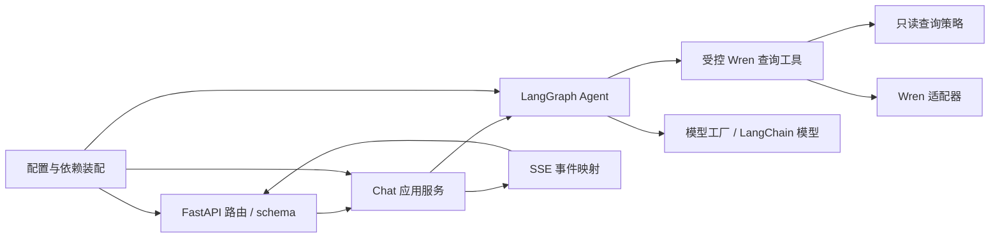

# AskDB Agent 架构骨架与开发规范

- 状态：设计基线，按当前 FastAPI + LangGraph + WrenToolkit 实现演进
- 日期：2026-10-01
- 范围：`askdb-agent/` Python 服务；不包含 Web、Wren Core 内部实现和 MCP/飞书扩展实现

## 1. 目标与原则

AskDB Agent 接收聊天请求，编排模型与受控工具，调用 Wren 完成业务语义查询，并以稳定 SSE 契约返回结果。代码骨架应让开发者能定位职责、替换外部依赖、独立测试安全边界，并在后续加入会话持久化或其他入口时不重写问数核心。

设计原则：

1. **先保持单体、按职责分层**：一个可部署 Python 服务，采用清晰模块边界；只有出现独立部署、独立扩缩容或独立所有权的实际需求时才拆服务。
2. **图负责编排，应用层负责用例，领域策略负责确定规则**：LangGraph 控制模型/工具步骤，应用服务组织一次聊天，SQL 只读策略不依赖模型是否遵循提示。
3. **外部系统经适配器接入**：Wren、聊天模型、存储、追踪等依赖在边界处初始化；核心逻辑可以用替身测试。
4. **接口和事件先于 UI 偶然行为**：请求、错误、SSE 事件和结果字段均有显式 schema 与版本兼容要求。
5. **按当前需求实现，不预造框架**：MCP registry、多租户、持久化 checkpoint、复杂多 Agent、插件系统都作为未来决策，不先创建空壳。

## 2. 组件关系与依赖方向



依赖由外向内：API 与装配层可以引用应用层、图和适配器；图可以使用领域状态和工具接口；领域策略不得反向依赖 FastAPI、LangChain、Wren 或数据库客户端。API 不能直接调用 Wren；图与工具不能自行读取进程环境变量；领域层不负责 HTTP/SSE 序列化。

## 3. 建议代码骨架

先按以下结构整理新代码；不要求为每个文件提前创建空模块。当前实现迁移时保持端点和 SSE 契约兼容。

```text
askdb-agent/
├── pyproject.toml
├── uv.lock
├── .env.example
├── README.md
├── src/
│   ├── main.py                    # ASGI app 导出与生命周期
│   ├── api/
│   │   ├── app.py                 # create_app、依赖注入
│   │   ├── routes/chat.py         # HTTP endpoint，仅做协议适配
│   │   ├── schemas/chat.py        # Pydantic 请求/响应 schema
│   │   └── streaming.py           # 内部事件到 SSE 的编码与清理
│   ├── application/
│   │   ├── chat.py                # 一轮聊天用例及取消/错误边界
│   │   └── ports.py               # 应用层依赖协议（仅有替换价值时定义）
│   ├── agent/
│   │   ├── graph.py               # graph factory / compiled graph
│   │   ├── state.py               # Graph state 与 runtime context 类型
│   │   ├── prompts.py             # 系统提示与版本化提示片段
│   │   └── nodes.py               # 有自定义 StateGraph 时的节点
│   ├── domain/
│   │   ├── query_policy.py        # 确定性只读 SQL 规则
│   │   ├── errors.py              # 稳定的领域错误类型/错误码
│   │   └── result.py              # 查询结果领域结构（需要时）
│   ├── tools/
│   │   └── wren_query.py          # LangChain tool schema 与策略调用
│   ├── integrations/
│   │   ├── wren.py                # WrenToolkit 初始化/调用适配
│   │   └── models.py              # chat model 初始化
│   ├── config.py                  # Settings、校验与环境映射
│   └── observability.py           # 日志字段、trace/callback 配置
└── tests/
    ├── unit/
    ├── api/
    ├── integration/
    └── evals/
```

约定：

- 保留 `src` 布局和 `pyproject.toml`/`uv.lock`，依赖锁文件随依赖变更更新并提交。
- `main.py` 只暴露 ASGI 应用；`api/app.py` 负责 `create_app` 与依赖装配。应用启动时显式初始化 runtime，health/readiness 分开描述进程存活和依赖可用。
- `agent/graph.py` 暴露 `build_graph(settings, dependencies)`；FastAPI 的 `build_runtime()` 通过装配模块组合配置、模型、Wren 工具及图。当前 `create_agent` 简单路径可继续使用，只有业务分支、显式状态或检查点需要时才升级成手工 `StateGraph`。
- 若要使用 LangGraph CLI/Studio，本地开发时增加 `langgraph.json` 并导出 graph；这不是替换现有 FastAPI API 或引入托管运行时的前提。
- 不要为了符合目录图而拆小模块。模块应有单一职责、可读接口和独立变化理由。

## 4. 关键运行边界

### 4.1 配置和依赖装配

- `Settings` 集中解析环境变量并在启动时校验必填项、范围和互斥关系；业务模块接收 Settings/依赖对象，不散落 `os.environ` 和 `load_dotenv()`。
- 本地 `.env` 仅用于开发，必须 gitignore；`.env.example` 只列变量名、用途和无敏感默认值。生产凭证由运行环境/密钥服务提供。
- Wren 项目路径、profile 与模型在 runtime 创建时显式固定。禁止隐式选择 active profile、从请求字段接收任意项目路径或把 API key 放入 prompt、SSE、异常文本。
- Runtime 以 FastAPI lifespan 管理创建与关闭；初始化失败使 readiness 不通过，并产生不含凭证的可操作日志。

### 4.2 LangGraph 与状态

- State 只放图中后续节点确实需要的数据；区分输入、内部状态和最终输出，避免把完整请求对象、秘密或大型结果重复放入 checkpoint。
- 稳定配置使用 runtime context 或显式依赖注入；每轮变化的数据从输入/state 传递。`thread_id` 是会话标识，不等于身份或授权凭证。
- 配置 checkpointer 前先定义会话隔离、保留期、删除、并发写入和敏感数据策略；无持久化承诺时，不给用户暗示重启后会话可恢复。
- Graph 节点应可单独测试；节点只返回自己负责的 state 更新，不原地修改共享状态。外部副作用（特别是查询执行）必须有明确入口和次数/重试语义。
- 提示词明确业务语义和工具使用方式，但不得把提示词当权限控制。提示词变更需有代表性问句回归样例。

### 4.3 Wren 工具与 SQL 安全

- Tool schema 使用明确字段、约束和可读描述；工具做协议适配，授权与只读判断留在可独立验证的确定性策略/服务中。
- 问数执行顺序固定：解析并验证单条只读查询 → Wren dry-plan → Wren dry-run → 设置行数上限后执行 → 将列/行/截断信息归一化。前置步骤失败时不得执行查询。
- 限制必须至少包括只允许 SELECT/CTE 查询、拒绝多语句与锁定读、阻断高风险函数、强制结果上限、超时和取消传播。实际能力以 MySQL 只读账号权限作为最终防线；SQL parser 是附加校验而非隔离边界。
- 把原始 SQL、数据库错误和结果数据作为敏感信息处理：默认不写入普通日志，不随状态事件或错误事件回传；仅通过定义好的结果事件提供必要字段。
- 默认关闭会写入 Wren memory/知识的工具。任何写入型工具需要独立授权、审计、确认流程与负向测试后才能开放。

### 4.4 API、SSE 与错误

- 路由只完成输入校验、调用应用用例、选择 HTTP 状态码和建立流；不直接编排模型/工具。
- SSE encoder 是唯一事件序列化入口。事件具有稳定名称、schema 和字段含义；每次请求最多发送一个终结事件（`done` 或 `error`），客户端断开时尽早取消下游任务。
- 将 LangChain/LangGraph 内部 callback 事件映射为公开事件，不直接把任意内部事件透传给浏览器。内部步骤名需采用 allowlist，防止泄漏工具参数和上下文。
- 错误在边界映射为稳定错误码与面向用户文案；日志可有 request/thread correlation id 和异常类型/trace id，不包含 secret、完整 prompt 或完整查询结果。
- `/healthz` 只说明进程存活；readiness 应检查已装配的依赖状态，但不应执行业务查询。

## 5. 开发规范

### 代码与接口

- Python 使用类型注解、Pydantic 边界 schema 和小型显式函数；公共函数、端口和安全规则写清输入、输出、失败条件。
- 依赖只在 `config.py`/装配层创建并向下传递。禁止在 import 时连接模型、Wren 或数据库。
- 不做静默 fallback：缺少配置、模型不可用、Wren 未就绪时返回确定错误；不偷偷换 profile、模型或数据源。
- 外部 SDK 类型限制在 adapter/tool 边缘；领域策略和 API schema 不暴露 SDK 私有对象。
- 依赖版本范围需要有理由，锁文件确定复现版本。升级 LangChain/LangGraph/Wren 时记录兼容性变化并运行相关回归。

### 测试分层

1. **单元测试**：SQL 解析/策略、输入约束、结果归一化、错误映射、SSE 编码；外部依赖使用 fake/mock。
2. **Tool/应用契约测试**：校验调用次序、每步失败不越过门禁、行数/超时限制、取消传播、错误与事件结构。
3. **Graph 测试**：为每个测试构造独立 graph 和内存 checkpointer；验证工具路由、状态更新、会话隔离及中断/失败路径。
4. **API 测试**：通过 `TestClient`/ASGI transport 注入 fake runtime，覆盖 schema、HTTP 状态、SSE 顺序、终结事件和客户端断连行为。
5. **集成测试**：单独标记，显式要求模型/Wren/只读数据库配置；覆盖少量已知问句并核对 SQL 与真实结果，不让默认单测依赖网络或生产数据。
6. **问数 eval**：维护经审阅的代表性案例，至少比较可执行性、结果正确性、语义一致性和拒答/安全行为。模型或提示词更改后运行；不得以单次模型回答替代确定性 SQL 安全测试。

测试数据不得含真实凭证或不必要的个人/业务明细。失败测试应打印最小诊断信息，不输出 key、完整对话或业务结果。

### 变更流程

1. 先明确改动影响的接口、数据流、安全边界和兼容性。
2. 为新增行为先定义可观察契约和失败场景，再实现最小垂直切片。
3. 新工具必须说明用途、输入、权限、副作用、超时、结果上限、错误和审计字段；先写越权/无效输入拒绝用例。
4. 提示词、模型参数或图路由变化要附代表性 eval case 或说明为何不适用。
5. API/SSE 兼容性变化要同步 Web 契约文档和前端消费方，并明确事件版本/迁移方式。
6. 架构边界、依赖选择、会话持久化、模型策略或权限模型等难逆决定记录 ADR；小型实现细节不写 ADR。
7. 合并前运行变更相关的格式/静态检查和测试，并在交付说明中报告实际命令及未覆盖的集成边界。

建议先采用的开发命令（与项目配置保持同步）：

```bash
uv sync --locked --group dev
uv run pytest -q
```

后续可在 `pyproject.toml` 统一增加 lint/type-check 工具和命令；工具确立前不同时引入多套格式化/静态检查系统。

## 6. 当前代码到目标边界的映射

| 当前文件/职责 | 目标位置 | 整理时注意 |
|---|---|---|
| `src/api.py` 请求 schema、FastAPI 路由、SSE 编码 | `api/schemas/chat.py`、`api/routes/chat.py`、`api/streaming.py` | 保留公开请求和事件行为；把通用事件映射移出路由 |
| `src/runtime.py` Settings、Wren/model 初始化、Agent 构建 | `config.py`、`integrations/`、`agent/graph.py`、装配层 | 避免拆成纯转发函数；用显式依赖构造便于测试 |
| `src/query.py` SQL 策略和 LangChain Tool | `domain/query_policy.py`、`tools/wren_query.py` | 策略不依赖 LangChain；工具按固定顺序调用 Wren |
| `tests/test_*.py` | `tests/unit/`、`tests/api/`、`tests/integration/` | 按测试目的归类，不为了目录重排改变验证范围 |

建议渐进迁移顺序：先抽配置与 runtime 装配边界，再拆 API schema/streaming；之后分离查询策略与 Tool adapter；最后在出现真实图复杂度或持久化需求时引入显式 graph state/checkpointer。每步维持现有问数 API 可运行。

## 7. 对 LangChain/LangGraph 工程的借鉴与取舍

借鉴官方 LangGraph 应用结构中 graph 与 `state`、`nodes`、`tools` 的清晰组织、显式依赖/环境配置、以及可独立构造测试 graph 的做法。AskDB 使用 FastAPI 作为自有服务契约，因此只借鉴内部模块化和可测试性；不因为示例模板使用 LangGraph Server/托管部署就替换当前 API。官方文档也区分了简单 `create_agent` 场景与自定义图测试方式，故 AskDB 当前保持简单 Agent factory，等出现分支流程、人工确认或状态恢复需求再手工定义 StateGraph。

参考资料（官方一手来源）：

- [LangGraph Application Structure](https://docs.langchain.com/oss/python/langgraph/application-structure)：应用由 graph、配置、依赖和环境构成；示例结构将 tools、nodes、state 独立组织。
- [LangGraph Test](https://docs.langchain.com/oss/python/langgraph/test)：按测试构造 graph 与独立 checkpointer，可单测节点或局部路径。
- [langchain-ai/new-langgraph-project](https://github.com/langchain-ai/new-langgraph-project)：官方最小 Python 项目模板，展示 graph 导出、配置 context 与本地开发入口。
- [langchain-ai/react-agent](https://github.com/langchain-ai/react-agent)：官方 ReAct 模板，展示工具可扩展和 LangGraph 的开发/调试方式。

## 8. 本设计的未决项

- 当前 API 请求携带完整消息历史，未来是否改为服务端持久化会话，需要先决定用户身份、租户隔离、保留与删除策略。
- 生产部署需要确定 SQL 执行超时、并发/速率上限、身份授权与审计方案。
- 若要暴露 LangGraph Studio/Server，需要明确其监听范围、鉴权和与 FastAPI 的职责关系。
- 引入其他渠道或 MCP 工具前，单独设计渠道身份到 AskDB 用户授权的映射和工具权限模型。

这些项目作为后续 ADR/专题设计入口；不会在本设计里预设其答案。
