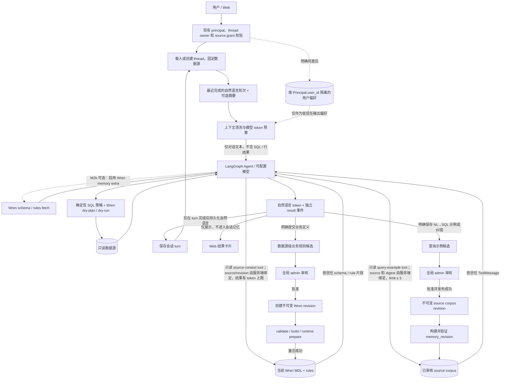

# ASKDB Agent 记忆体系设计

- 状态：方案草案，尚未进入实现
- 日期：2026-10-02
- 范围：`askdb-agent/` 的会话连续性、Wren 业务语义检索、已验证 NL→SQL 示例、记忆治理；保留当前 FastAPI + LangChain/LangGraph + WrenToolkit 技术栈

## 1. 结论摘要

采用四类彼此隔离的记忆：

1. **会话记忆**：按 thread 保存短期对话上下文，支持跨请求、刷新页面和服务重启后继续追问。
2. **业务语义记忆**：由 Wren MDL、`knowledge/rules/` 和数据源 revision 管理，是业务口径的唯一权威来源。
3. **已验证查询示例**：按数据源隔离，存储经审阅的自然语言问题和 SQL 模板，作为 Agent 只读召回的 few-shot 证据；适配 Wren memory 属于可选后端。
4. **个人偏好记忆**：当前不启用；Agent 已有本地账号 principal，可作为未来的 owner scope。是否启用由明确同意、查看/修改/删除能力和隐私策略决定，OIDC/SSO 不是 M1 的技术前置条件。

任何记忆都只是上下文证据，不能授权访问数据、跳过当前 SQL 安全策略或覆盖 Wren MDL。模型成功生成答案、查询执行成功或用户没有反对，都不等于该结果已被验证、可以写入共享记忆。

用户已确认记忆共享边界：会话按 thread 短期保存；审核发布后的业务规则和 NL→SQL 示例按数据源共享；个人偏好仅按已认证用户隔离保存。V1 规则审核使用现有全局 `admin`；首版 memory-enabled runtime 限制为单 Agent 进程。thread 30 天无用户活动自动到期与用户手动删除都会删除关联业务规则；手动删除需明确确认，自动到期不弹确认。已发布 NL→SQL 示例是独立的数据源记忆，不随 thread 到期/删除自动撤销。thread、候选与备份期限采用本设计列出的默认值；superseded Wren/query-corpus revisions 与备份均保留 30 天；生产恢复必须先重放独立 journal；OIDC/SSO 不是现有本地账号能力的前置条件。

## 2. 当前实现基线

- Web 的 `local-thread-adapter` 把展示历史写入浏览器 `localStorage`，每次 `/v1/chat` 请求发送完整文本 `messages`。`agent-chat-adapter` 会把 SSE `result` 中的 SQL 和表格拼进 assistant 文本，再将其作为普通 assistant 消息发送；服务端收到时已经没有独立的 result 结构。BFF 对请求字段有独立 allowlist 和 64 KiB 请求上限。
- Agent 已有本地账号密码登录、Bearer session、`Principal.user_id`，角色为 `admin` / `member`；member 的数据源访问由 grant 控制。`/v1/chat` 依赖 `require_current_user`，并将 thread owner 与数据源绑定写入 `chat_thread_data_sources`，每轮重查 owner、账号状态和 source 权限。该认证不是 OIDC/SSO。
- Web 当前在浏览器侧生成形如 `${user_id}:${uuid}` 的 thread ID，并在 localStorage 保存 title、归档状态、数据源和模型选择。数据库中的 `chat_thread_data_sources` 只保存 `thread_id`、`owner_user_id`、`data_source_id` 和创建时间，不保存 turn 内容；目前也没有服务端 thread 列表/删除 API。
- Agent API 的 `ChatRequest` 接收 `thread_id`、可选的 `data_source_id` / `model_profile_id` 和最多 40 条 `messages`；`stream_chat_events` 将其作为 LangGraph 输入并传入 `thread_id`。`build_graph()` 没有 checkpointer/store，因此服务端没有跨请求消息持久化。
- 当前依赖锁定 `wren-langchain 0.2.0` 与 `wrenai 0.15.0`，声明了 connector extras，但未安装 Wren `memory` extra 或 `lancedb`。`include_memory_write=False` 只在 Wren memory provider 已启用时隐藏写工具；`WrenToolkit` 需检测到项目内 `.wren/memory/` 才暴露 fetch/recall 工具。Wren CLI 的 grep backend 可做 NL→SQL recall，但 `wren memory fetch` 的语义 schema 检索需要 `wren[memory]`；当前 WrenToolkit 的 memory provider 直接打开 LanceDB `MemoryStore`，不能假设 CLI grep 能力会自动成为 toolkit 工具。
- `WrenProjectBuilder` 生成不可变项目 revision 并写入 `knowledge/rules/`，不会创建 `.wren/memory/`。所以即使安装了 `wren-langchain`，当前新建 runtime project 也不会自动带有可用的 memory tools。
- Wren 数据源目录、revision、operations 和 `chat_thread_data_sources` 当前都由 `WrenSettingsStore` 写入 SQLite；建表是 `_connect()` 中的 `CREATE TABLE IF NOT EXISTS` 加列检查/`ALTER TABLE`，仓库没有通用版本化迁移 runner。`start_apply()` 将 operation 写 DB，但用进程内 `asyncio.create_task` 执行；当前 active revision 指针在 runtime 激活前先更新。M1 应新增原子、可重入的 schema migration runner；memory 发布不能照搬现有仅进程内调度和“先改指针后激活”的顺序。
- `RuntimeSnapshot` 已按数据源 revision 和模型 profile 版本缓存；`RuntimeManager` 已提供 candidate prepare、原子激活和请求 lease。Wren revision 的 `mdl_digest` 当前由 `target/mdl.json` 字节的 SHA-256 生成，方案应复用并明确定义额外的规则/连接器兼容摘要。未来若启用 PostgreSQL 多 worker，必须迁移 WrenSettingsStore、thread binding、memory 操作/active pointer 到同一共享事务存储；只把新 memory 表放 PostgreSQL 不足以跨 worker 一致。

相关代码：[Agent graph](../askdb-agent/src/askdb_agent/agent/graph.py)、[chat API schema](../askdb-agent/src/askdb_agent/api/schemas/chat.py)、[chat route](../askdb-agent/src/askdb_agent/api/routes/chat.py)、[auth principal](../askdb-agent/src/askdb_agent/domain/auth.py)、[Web chat adapter](../askdb-web/lib/agent-chat-adapter.tsx)、[thread adapter](../askdb-web/lib/local-thread-adapter.tsx)、[Wren project builder](../askdb-agent/src/askdb_agent/integrations/wren_project.py)、[runtime manager](../askdb-agent/src/askdb_agent/application/runtime_manager.py)。

## 3. 术语和信任边界

| 名称 | 内容 | 作用 | 权威来源 |
|---|---|---|---|
| 会话记忆 | 当前 thread 的用户消息、简短助手答复和压缩摘要 | 解决“上一轮说的那个指标/时间范围” | Agent 会话存储 |
| 业务语义 | 模型、字段、关系、指标规则、业务词汇 | 定义业务含义和 SQL 可用模型 | Wren MDL 与受审阅的 `knowledge/rules/` |
| 查询示例 | 问句、参数化 SQL 模板、来源和校验信息 | 给相似问法提供示例，不定义业务规则 | 按数据源隔离的受审阅 corpus |
| 个人偏好 | 用户明确要求记住的表达或展示偏好 | 个性化回答格式 | 认证后的用户记忆库 |
| 记忆候选 | 用户纠正、明确保存请求或待审核示例 | 等待验证；默认不可检索 | 候选队列 |

信任顺序：**当前权限与确定性规则 > 当前 Wren revision > 已审核业务规则 > 匹配当前 MDL 的查询示例 > 会话摘要与个人偏好**。低优先级信息不能推翻高优先级规则。

以下内容禁止写入长期共享记忆：数据库凭证、模型密钥、查询结果行、完整执行错误、个人/客户标识值、一次性日期或筛选值、未审核的模型推测。会话原文仍可能包含敏感信息，若需要服务端保存，必须有身份隔离、加密、期限和删除机制。

## 4. 推荐架构



**读路径**：现有 principal 与 source grant 校验 → 读取 owner/source 固定的 thread → 清洗自然语言历史并按当前模型 profile 预算 → Agent 按需调用两个由服务端上下文绑定的只读 lexical tool：从当前 Wren revision 的 MDL/rules 检索语义片段，以及从匹配 `semantic_digest` 的 active corpus 检索最多 3 个 query examples → 模型生成 SQL → 现有确定性安全门禁 → Wren 执行 → SSE 分开发送自然语言 token 和 result 事件。M2a 先实现应用层词法检索；Wren embedding/schema fetch 作为 M2b 可选能力，须先安装并验证 `wren[memory]`。

**写路径**：用户消息先以 `RUNNING` turn 记录；只有 Agent 流正常结束才保存自然语言答复并标记 `COMPLETED`。明确提交的业务定义进入独立候选队列；全局 admin 审核后，从当前活动 Wren revision 创建新 revision，把规则写进该版本的 `rules` 配置，由 `WrenProjectBuilder` 生成 `knowledge/rules/*.md`，validate/build/runtime prepare 成功后才激活。NL→SQL 查询示例走另一条路径：审核后生成不可变 canonical corpus revision 并重建 lexical index。两类发布共用 source 级串行化和恢复机制，但不共用权威内容存储。失败或构建未通过时保留旧活动版本。

## 5. 各层记忆设计

### 5.1 会话记忆：短期、按 thread 隔离

**保存内容**

- 用户的自然语言消息。
- 助手的自然语言结论摘要，不包含 SQL 代码块和表格行。
- 一个可选的压缩摘要，仅从已完成 turn 的自然语言内容生成；保存 `summary_through_sequence`、来源 `turn_id`、生成版本和时间。摘要生成失败时保留旧摘要，并按 token 预算减少最早的完整轮次，不阻塞当前问答。
- thread 绑定的数据源、创建/最近使用/到期时间和删除状态。

**不保存内容**

- Wren 工具调用完整 payload、数据库行、原始异常或密钥。
- 模型内部推理文本、未确认的用户画像和跨 thread 对话。
- SQL 作为对话历史反复回灌；SQL 示例如需复用，必须走 5.3 的审核流程。

**上下文组装**

- 仅读取当前 thread；不会按相似度搜索其他人的对话。
- 先放系统规则和当前问题，再放最近对话；较早内容只通过摘要补充。
- 服务端只保存新的 user 文本和经过清洗的 assistant 自然语言；SSE `result`（SQL/行数据）作为独立展示 artifact 留在当前浏览器的 localStorage UI cache，不拼进 Agent 输入，也不做跨设备恢复。清除浏览器数据可能删除这些历史结果；若将来要求跨设备恢复结果，必须单独设计结果 artifact 的授权、TTL、删除和不进入模型上下文策略。
- UI cache 按当前登录账号分区，登出/账号切换时清除当前账号的结果 cache；本地结果 cache 和服务端 thread 采用相同 30 天默认 TTL。thread 删除后当前浏览器立即删本地条目，其他浏览器在下一次 thread 同步时清理；离线 cache 无法远程擦除。
- assistant 持久化前移除 fenced code、result 标记和检测到的 SQL 片段；若无法可靠提取自然语言则该轮只保存 user 文本，不保存 assistant 文本。用户输入中的 secret-like 值按持久化前的脱敏规则处理；脱敏规则需固定并覆盖常见凭证格式，原始请求不写日志。历史迁移只导入纯 user 文本和能按现有 `formatQueryResult` 标记可靠切出的 assistant 自然语言；不能可靠切分的内容留在本地 cache、不导入 server memory。
- 按管理员在 model profile 配置的可信 `context_window_tokens`、`max_output_tokens` 和 provider-compatible `tokenizer_id` 做预算；三项必须显式配置且有效，否则禁止该 profile 启用服务端记忆。预算包含系统提示、tool schema、当前 user 消息、历史和召回示例。各 memory tool 共用同一 turn 级 `MemoryTokenBudget`，只使用扣除系统提示、当前问题和输出预留后的剩余输入预算；超预算按最低相关度示例、最旧完整轮次、摘要的顺序裁剪，不截断当前问题。固定提示加当前问题本身超限时 fail closed 并返回 `CONTEXT_BUDGET_EXCEEDED`。当前模型配置没有这些 token 字段，M1 需增加管理员配置字段及 tokenizer 可用性校验。
- 摘要是低信任压缩文本，不得作为授权条件或事实来源；关键业务定义必须回到 MDL/rules 查询。

**保留和到期规则（V1 默认，时间均用 UTC）**：thread 自最近一次被服务端接受的用户 turn 起保留 30 天；新建空 thread 以 `created_at` 作为初始活动时间。`expires_at <= now_utc` 即视为过期；一次用户 turn 在 `begin_turn` 事务提交时即算接受，因此之后失败/取消也续期；同一 turn 重放、标题/归档修改和管理员审核不续期。到期 sweeper 每 5 分钟运行一次，服务启动时先扫过期项再开放 chat。手动删除和自动到期都先原子 tombstone、禁止读取/写入、删除该 thread 的消息/摘要/未发布候选，并立即 suppress 与该 thread 关联的已发布业务规则；随后异步发布移除这些规则的新 Wren revision。手动删除前必须确认；到期不确认。删除/到期不会自动撤销已发布的 source 级 NL→SQL 示例。UI 在用户提交规则时说明 30 天无活动到期也会移除此共享规则；thread 列表展示到期日。当前浏览器的本地结果 cache 删除后立即清理；其他在线浏览器在下一次同步时清理，离线副本无法被服务端远程擦除。删除操作状态保留 7 天；不含规则/示例正文的 suppression ledger 至少保留 60 天，若可能包含该规则的历史 revision/备份仍可恢复则继续保留。superseded Wren 与 query-corpus revisions 自 superseded 时间起各保留 30 天，备份自创建时间起保留 30 天；历史文件还被运行中的 runtime lease 引用时，清理延后到最后一个 lease 释放。恢复前校验 generation manifest/hash、按其中记录的 `journal_applied_seq` 重放独立 journal 中更大的序号并重建索引；生产必须使用独立 journal，不能从滚动快照本身恢复该 journal。静态加密和密钥轮换按部署环境配置。数据源授权每次请求仍向现有 Auth/Wren catalog 重新验证。

### 5.2 业务语义：Wren 是唯一事实源

- 表/字段/关系/指标/命名口径继续放在 Wren MDL、views、cubes 和 `knowledge/rules/`，通过现有 revision、validate、build、apply、rollback 流程管理。
- 对稳定且影响答案正确性的口径，走数据源设置的显式编辑和 revision 发布；不要从一个对话自动改写业务规则。
- **跨会话业务规则候选**：用户明确说“以后新会话也记住”或选择“提交为该数据源共享规则”时，界面先说明规则审核通过后会对该 source 下所有有权限的用户生效，并在 thread 删除或 30 天无活动到期时一并移除。系统只从用户明确给出的定义生成候选；术语/定义不完整或模型需要推断时先询问，不创建候选。提交前展示将保存的术语、定义和 source；用户确认“提交审核”后才持久化，普通澄清仍只属于当前 thread。
- 候选记录包含 `candidate_id`、`data_source_id`、`submitted_by`、来源 thread/turn ID、提交时的 `base_wren_revision_id` / `base_semantic_digest`、术语、定义、可选 model/field 引用、受限结构化条件、`content_hash`、`content_version` 和创建/到期时间。首版输入限制：术语 1–128 字符、定义 1–2,000 字符、候选 JSON 不超过 16 KiB；`condition_json` 仅允许最多 8 个对已存在 model/field 的谓词，operator 固定为 `EQ | IN | GT | GTE | LT | LTE | IS_NULL`，literal 仅允许 string/number/boolean/null，禁止任意表达式、SQL、代码、动态标识符和嵌套查询。候选及审核事件写入与 `chat_thread_data_sources` 相同的事务数据库独立表；source/thread 归属由服务端绑定，来源 turn 不设阻止会话清理的外键。
- 审核状态和发布状态分别保存。审核状态为 `PENDING | NEEDS_SUBMITTER_INPUT | APPROVED | REJECTED | WITHDRAWN | NEEDS_REVALIDATION | REVOKED | EXPIRED`；发布状态为 `NOT_STARTED | QUEUED | BUILDING | PREPARED | ACTIVATING | ACTIVE | FAILED`。`APPROVED` 仅表示审核通过，不能被召回；只有规则存在于当前 active Wren revision 并成功进入 runtime 后才生效。状态转换使用 expected status 做 CAS，并追加不可变审核事件。审核 reason 限 500 字符，不得复制候选全文、SQL、查询参数或个人标识值；审计正文只存必要的 hash/status/actor/time。
- 业务规则状态转换固定为：`PENDING → NEEDS_SUBMITTER_INPUT | APPROVED | REJECTED | WITHDRAWN | EXPIRED`；`NEEDS_SUBMITTER_INPUT → PENDING | WITHDRAWN | EXPIRED`；`APPROVED → NEEDS_REVALIDATION | WITHDRAWN | REVOKED`；`NEEDS_REVALIDATION → APPROVED | REJECTED | WITHDRAWN | EXPIRED`。提交者仅可在规则未激活时撤回；发布开始后撤回请求必须与发布操作 CAS 竞争，若规则已激活则只能走 admin revoke。澄清回复会增加 `content_version`、生成新 `content_hash` 并追加事件，回到 `PENDING`；REJECTED/WITHDRAWN/REVOKED/EXPIRED 为终态。候选自首次创建满 90 天过期，thread 先过期时按 thread 到期级联删除。
- V1 有有效 source grant 的 member 可提交；现有全局 `admin` 审核、请求补充、批准、拒绝或撤销。审核 actor 必须从当前认证 Principal 读取。审核需确认该术语无未解决冲突、所引用 model/field 存在于基准 MDL；无法确认时转 `NEEDS_SUBMITTER_INPUT`，不得由模型自行推测发布。
- 候选记录提交时固定基准 Wren revision 和 `semantic_digest`。发布时若活动 revision/digest 已变化，候选转 `NEEDS_REVALIDATION`，由 admin 对照新 MDL 重新确认，不自动迁移旧定义。候选处于审核阶段时 DB 保存正文；成功发布后 Wren revision 成为唯一规则正文权威，候选行清除 term/definition/condition 和来源 thread/turn 明文，仅保留 stable rule ID、content hash、审核事件和 revision/operation metadata。发布协调器在 active generation/runtime 对外可见前，先持久化最小来源关系到独立 `business_rule_origins` 表 `(data_source_id, business_rule_id, source_thread_id)`；该表不含定义、消息或 source turn，只服务删除级联，不是规则正文副本，不使用会阻止 thread 清理的外键。origin row 与候选正文清理遵循发布 operation 状态，runtime 尚未激活时仍可从候选恢复；同一 source operation lock 串行化发布与 thread 删除/到期，发布激活前还要检查来源 thread 未 tombstone、rule ID 未 suppression。thread 的到期时间由现存 thread 行权威提供，因此新 turn 续期无需重复改写 origin 表。管理员可按 source 审核规则，但管理界面不据此提供 thread 内容访问。thread 手动删除或到期时，删除事务先读取该关系、写入每个 rule ID 的 suppression tombstone 和删除事件，再清除候选正文、clarification 文本及明文 `source_thread_id`；关系仅留下不可反查的 keyed HMAC 与无内容的 hash/status/actor/time 审计。这样规则正文只在 Wren revision，来源关联在活动期间足以级联；被删 thread 不留下可回查 ID。查询示例同理：canonical corpus revision 激活后清除候选行中的 question/SQL 正文，只保留 hash、审核和 corpus revision 关联；thread 删除/到期清除未发布示例候选的正文和来源 ID，已发布示例保留 source 级内容与不可反查的来源 HMAC。
- 发布从当前活动 Wren revision 的语义配置派生新 revision，追加经审核规则；规则内容的权威副本属于 Wren revision，`WrenProjectBuilder` 生成的 `knowledge/rules/*.md` 是 validate/build/runtime 输入。当前 builder 以配置中的规则 `name` 生成文件名并截断内容至 20,000 字符；为保证删除/suppression 可精确对应，发布规则时将 `name` 固定为 `askdb_br_<business_rule_id 的 32 位小写十六进制>`，人类术语放在文件内容中，recall 索引以文件 stem 映射稳定 ID。内容采用固定、确定性的 Markdown 序列化模板：术语、经审核定义、可选 MDL model/field、结构化条件、稳定 Rule ID；用户自由文本只放在定义字段，不允许其覆盖模板字段或生成额外规则。`condition_json` 按固定顺序渲染为 field/operator/literal 条目，literal 使用 JSON 编码，不生成 SQL。超出 Wren builder 的 20,000 字符上限或序列化结果不符合模板时拒绝发布。规则/索引测试需断言模板、ID 映射唯一且重建不变。查询示例仍保存在独立 canonical query corpus。禁止直接改活动项目文件或将业务定义复制到 query-example corpus。
- 同一 source 的 draft 编辑/创建、apply、rollback、规则发布/移除共用持久 source operation lock 与 generation CAS。删除事务先在会话/候选存储事务中 tombstone thread 并写 suppression；任何并发规则发布在激活前必须重新检查来源 thread 仍有效、候选未撤回且 rule ID 未被 suppress。由此即使发布构建先开始、删除随后发生，也不能把待删除规则激活回来。存在未应用 Wren draft 时，规则发布/移除排队并显示阻塞原因；发布 job 固定目标 revision ID，不得在后台执行时重新读取可变的 `draft_revision_id`，也不得覆盖管理员 draft。现有 `WrenSettingsApplication.start_apply()` 用进程内 `asyncio.create_task`，memory 发布任务不能复用这种仅存在于内存的 job 生命周期；启动时必须恢复持久队列中的未完成操作。
- Wren validate/build 与 `RuntimeManager.prepare_source_revision` 完成后，发布协调器在 source lock 内复核 base active revision，再切换 durable pointer 和 runtime。数据库指针与进程内 snapshot 不是同一事务，因此持久记录 `PREPARED/ACTIVATING` 操作；异常时补偿指针，进程重启时先对账/重建 runtime，再接收 chat。失败的 `publish_status=FAILED` 可幂等重试，旧 runtime 和旧 in-flight lease 不被中途替换。
- 撤销已发布规则也创建新的 Wren revision，移除对应规则后重新 validate/build/activate；不改写旧 revision。新版本激活前，旧活动版本仍是服务事实源，但 recall suppression 立即生效；管理端显示“在线已屏蔽/活动 revision 移除中”。V1 superseded Wren revision 内容保留 30 天供 rollback，之后物理清理；rollback 只能针对保留窗口内版本，并必须基于当前 suppression ledger 生成不含已删除 rule ID 的新 revision，不能直接重新激活旧文件。
- M2a 的应用层只读 `askdb_recall_source_context` tool 使用确定性 BM25/CJK bigram scorer 检索当前 Wren revision 的 MDL/rules，返回最多 5 个带 model/field 或 rule 文件来源的片段；`askdb_recall_approved_queries` 返回最多 3 个示例。统一先做 Unicode NFKC + casefold；ASCII/SQL 标识符按非字母数字和下划线分词，并保留完整标识符 token；中文连续片段生成相邻二元词。BM25 默认 `k1=1.2, b=0.75`，字段分数为 `2 × title/term BM25 + 1 × body/definition BM25`；同分按稳定 document ID 升序。只有分数 `> 0` 的文档才可返回，无正分命中时返回空集，不为凑足 top-k 填充低相关结果。source/revision 由当前 runtime 闭包绑定，工具不接受客户端 source 参数；每次返回 hits 前还要检查最新已应用的 suppression sequence/entry set，不能只依赖被旧 runtime lease 固定的索引快照。撤销操作返回成功后才开始的 recall 必须排除该示例；已在撤销前把示例放入模型上下文的 in-flight turn 无法追溯撤回，其响应不代表撤销后新发起的 recall。索引从不可变 revision 构建并随 `RuntimeSnapshot` 版本化；构建失败则候选 runtime 不激活。不要把整个 MDL/所有规则长期塞进每个会话摘要。
- 记忆检索得到的规则和示例都视为提示数据。查询仍需要当前 SQL parser 只读校验、Wren `dry_plan`、`dry_run` 和只读数据库账号。

### 5.3 已审核 NL→SQL 示例：按数据源共享

示例能复用业务中“某说法通常对应哪些指标/过滤”的经验，但成功执行本身不能证明指标和 JOIN 正确。因此示例须经过候选、审核、发布；只有已发布且兼容当前语义版本的记录参加 recall。`APPROVED` 表示审核通过，只有所在 corpus revision 激活后才可检索。

**录入来源**

- 用户明确点选“保存为查询示例”。
- 用户报告业务纠错后，形成待审核候选。
- 不因查询执行成功、回答被展示或没有收到差评而自动写入共享库。
- 候选只临时关联 source turn；批准发布后必须移除 `source_turn_id`，保留经脱敏来源 turn ID 计算的 keyed HMAC 和审核事件，不保留从该值反查 thread 的映射。
- 本节仅定义 NL→SQL 示例。业务定义候选按 5.2 写入 Wren revision，不在 query-example corpus 另存一份；两类候选可共用审核基础设施，但状态、发布目标和召回索引分开。
- 未发布 query-example 候选自创建起最多保留 90 天；来源 thread 被手动删除或自动到期时，待审候选正文和来源反向链接随 thread 清理。发布后的示例已成为 source 级记忆，删除来源 thread 不会撤销它；只有 admin 撤销/发布新 corpus revision 才停止召回。撤销必须先同步写 suppression/journal，在线 recall 立即停止；被 supersede 的不可变 revision 保留 30 天，过期并释放 runtime lease 后清理，rollback/restore 不能复活已撤销示例。

**审核门槛**

1. 归属当前 `data_source_id`，SQL 只引用其当前 MDL 模型。应用层从可信 thread/source 上下文绑定 source，不接受模型工具参数覆盖。
2. 把一次性日期、客户/用户 ID 等筛选值改为有类型的占位符；不允许字符串插值。模板声明参数名、标量类型和 SQL 方言，绑定采用 SQL AST 替换 + 方言 serializer，不用 regex 或自行拼接转义字符串；首批只支持经过验证的日期/时间、整数/小数、布尔和字符串标量，不支持任意表达式或动态标识符。当前 `wren_query` 接口接收 SQL 字符串、没有 bind 参数接口，因此重新验证必须由该 AST 编译器绑定合成的、非生产标识值和代表性日期，再生成具体 SQL 执行当前只读策略、`dry_plan`、`dry_run`；不能拿用户原始参数做审核样例验证。无法安全绑定的语法拒绝收录。
3. 不得保存查询结果行、凭证或个人标识值；检查 SQL/模板不包含字面敏感值。
4. 对业务语义进行人工确认，或通过有标准答案的受控 eval；只看 SQL 可执行不算语义验证。
5. 记录提交者、来源 thread/turn、审核人、审核时间/理由、当前 `wren_revision_id`、`mdl_digest`、connector、验证结果和内容 hash。审核事件只追加，不覆盖历史审核记录。

**审核角色（V1 默认）**

- 当前代码已有全局 `admin` / `member` 和数据源 grant，没有数据源管理员角色。V1 允许有 source grant 的 `member` 提交候选；仅全局 `admin` 可批准、拒绝、撤销和发布。审核 API 必须重新检查当前 Principal，不能接受请求体里的 reviewer ID 作为身份来源。
- 若后续需要数据源级管理员，再新增明确的 source-scoped role/grant；不得把普通数据源访问 grant 解释成审核权。
- 状态转换固定为 `PENDING → APPROVED | REJECTED | WITHDRAWN | EXPIRED`、`APPROVED → NEEDS_REVALIDATION | REVOKED`、`NEEDS_REVALIDATION → APPROVED | REVOKED`；REJECTED/WITHDRAWN/REVOKED/EXPIRED 为终态，重新提交需新 ID。提交者只能撤回尚未发布的 PENDING 候选。候选 90 天到期，thread 先删除/到期时则随 thread 提前清理。每次转换带 expected status 做 CAS，并原子追加不可变审核事件。
- Query example 的审核状态与发布状态分开保存：`APPROVED` 只进入待发布队列；只有处于 active corpus revision 且 `semantic_digest` 匹配的记录才可召回。发布状态复用 `NOT_STARTED | QUEUED | BUILDING | PREPARED | ACTIVATING | ACTIVE | FAILED`；发布失败时保持不可召回并允许 admin 幂等重试。撤销通过新 corpus revision 排除记录，不能原地改写历史 revision。

**版本和存储**

- 权威语料按 `data_source_id` 保存为不可变 revision；建议数据库保存候选、审核事件、revision manifest 和 active pointer，持久化 Agent state dir 保存 canonical JSON 条目及 hash（不放进 Git checkout 或可清理的 runtime temp）。目录名使用 source ID 的安全编码/hash，manifest 保留原 source ID。这样审核状态与原子激活有事务边界，文件可导出/diff，索引仍可重建。若首版选纯文件存储，必须另行定义跨进程锁、原子 rename、并发审核和崩溃恢复协议；不允许 DB 与文件各自成为不明确的双权威。
- 发布先写完整的新 corpus revision 和 manifest，再构建/验证索引并准备候选 `RuntimeSnapshot`，记录 `PREPARED` 发布操作。获得该 source 的激活锁后，数据库 CAS 更新 active revision/generation，并切换本进程 runtime；若切换失败则回滚 pointer 并保持旧 runtime。进程崩溃重启时，以持久 pointer 重建 runtime 后才开放 chat。索引是派生物，不作为唯一恢复来源。不可变 revision JSON/manifest 不写回 supersession 时间；数据库 lifecycle metadata 单独记录 `activated_at`、`superseded_at`、`delete_after`，TTL 从 `superseded_at` 起算。
- Wren 语义 revision 保持不可变。把某数据源已发布的 corpus revision 物化到独立 runtime 目录；不要把长期 corpus 只写进某个 Wren revision。
- `RuntimeSnapshot` 增加 `memory_revision` / corpus digest，runtime cache key 同时包含数据源 revision、memory revision 和模型 profile revision。新快照构建成功后再原子切换；旧请求继续持有旧 runtime lease。
- 将兼容摘要定义为 `semantic_digest = SHA256(canonical compiled target/mdl.json + sorted knowledge/rules file paths and bytes + connector_type)`；不含密钥、连接串或其他 secret。保留 `mdl_digest` 作为编译 MDL 的现有审计摘要。只有 `semantic_digest` 匹配当前 source 才允许 recall；MDL、规则或 connector 变化都令旧示例进入 `NEEDS_REVALIDATION`，审核通过后才重新发布。不自动把旧 SQL 适配新 schema。
- M2a 首版由应用层提供两个只读 tool：`askdb_recall_source_context` 从当前 Wren revision 的 MDL/rules 做 lexical recall；`askdb_recall_approved_queries` 从 canonical corpus 做 lexical recall。共享确定性 BM25 scorer：英文/SQL 标识符拆为小写 token，并补充 CJK 字符 bigram；rules 按标题/段落切块，MDL 按 model/field 粒度生成文档，分数相同时按文档 ID 稳定排序。schema/rules 最多 5 段、查询示例最多 3 条；工具不接收 `source_id`，由可信请求上下文绑定 source、revision/`semantic_digest`；两个 tool 共用 turn 级剩余 token 预算。索引从不可变 source revision/corpus 重建，作为 `RuntimeSnapshot` 派生资源。返回内容作为普通低信任 ToolMessage，并在审计日志中带 revision/hash，不记录查询/记忆文本。当前 Wren memory 工具不可用，不能依赖它完成 M2a。
- Wren schema semantic fetch / embedding index 属于 M2b 可选能力：先安装锁定版本兼容的 `wren[memory]`，为 runtime project 明确生成 `.wren/memory/`，确认工具列表和数据源边界，再与 lexical gold set 做召回评测。Wren CLI grep、WrenToolkit LanceDB provider 是不同路径，不能互相代替。索引可删除后从 canonical corpus 重建。

### 5.4 个人偏好：认证后再启用

当前 Agent 已有可信本地 `Principal.user_id` 和 thread owner 校验。个人偏好仍暂缓，直到明确同意、查看/修改/删除/关闭入口、保留期限和审计策略都设计完成；启用时按 `Principal.user_id` 隔离，不依赖 thread ID。OIDC/SSO 不是技术前置条件。

允许的初始内容：回答语言、表格/图表偏好、常用但非敏感的表达约定。禁止保存凭证、授权范围、个人/客户记录 ID、常用敏感筛选条件。偏好只影响输出格式，不能推断访问权、替换当前数据源或更改业务指标口径。

当前版本不创建个人偏好表，不以 `thread_id` 或浏览器 localStorage key 推断用户身份。服务端 thread 可复用现有本地认证和 owner/source grant，但所有 thread API 都必须执行相同校验。

## 6. 存储与模块边界

### 6.1 推荐存储

| 数据 | 推荐权威存储 | 索引/缓存 |
|---|---|---|
| thread owner/source、turn、摘要和候选审核状态 | 首版放在与 `chat_thread_data_sources` 相同的事务型数据库中，使用独立表；不存入设置 JSON/模型凭证明文列。生产多 worker 使用 PostgreSQL；单实例可 SQLite | LangGraph 每轮状态只在内存中运行；无需保存模型工具 payload |
| MDL、规则和 schema revision | 不可变 Wren revision 的语义配置；`WrenProjectBuilder` 生成的 revision 项目是 validate/build/runtime 输入 | Wren 编译后的 `target/mdl.json`；rules index 从同一 revision 的 `knowledge/rules/` 重建 |
| 已审核查询示例 | 按数据源保存的不可变 canonical JSON corpus revision，数据库存 manifest、hash、active pointer 和 supersession lifecycle metadata | 应用层 lexical 索引；可删除重建 |
| 删除/撤销 journal | 生产使用与可恢复快照集物理隔离的加密 durable append-only journal；只记事件序号、类型、source 与稳定对象 ID，不保存记忆正文 | 按快照内 `journal_applied_seq` 幂等重放；不作为 recall 索引 |
| 业务规则候选 | 与 thread registry 相同的事务型数据库，独立候选和审核事件表；发布后内容进入 Wren revision，不进入 query corpus | 不加入模型 recall |
| NL→SQL 示例候选 | 同一事务型数据库保存候选与审核事件；批准内容进入不可变 canonical JSON corpus revision | 不加入模型 recall，直到 corpus revision 激活 |
| 个人偏好 | 认证后使用有 owner scope 的存储 | 仅该 owner 的私有检索索引 |

复用当前 thread owner/source registry 所在数据库，可让 thread 创建、绑定和删除在一个事务内完成；新增专用表，不把会话正文塞进配置/凭证明细字段。当前 WrenSettingsStore 的 SQLite DDL 没有版本化 migration runner，M1 新建 `schema_migrations`/编号 migration，在服务接受请求前串行完成迁移并保证重复启动安全。若部署环境必须把会话正文与身份目录放在不同数据库，则需先定义 owner/source 的唯一权威、跨库创建/删除 saga、重试和对账流程。SQLite 仅支持 V1 单 Agent 进程；启用 WAL、文件权限、加密存储、备份及恢复演练。未来转 PostgreSQL 时，WrenSettingsStore、thread binding 和 memory metadata 必须一起迁移；PostgreSQL 也不自动同步各进程内的 `RuntimeSnapshot`。启用多 worker/多实例前必须增加 durable generation pointer、变更通知/轮询、每 worker prepare/ack 和 lease 前代际校验。发布操作只有全部目标 worker 已激活才报告 `ACTIVE`；未确认的 worker 不得用旧 memory revision 接收新 turn，旧 lease 可继续完成。LangGraph 的图状态不持久化；如未来要支持工具中断恢复，再单独评估有脱敏和 TTL 的 checkpointer。

### 6.2 建议代码结构

```text
askdb-agent/src/askdb_agent/
├── domain/
│   └── memory.py                 # MemoryType、CandidateStatus、强类型记录
├── application/
│   ├── conversation_memory.py    # 载入、摘要、保留、删除
│   ├── memory_context.py         # 身份/data-source 过滤和 token 预算
│   ├── query_memory.py           # NL→SQL 候选、审核、corpus 发布和失效
│   └── business_rule_memory.py   # 业务规则候选、审核、Wren revision 发布协调
├── integrations/
│   ├── conversation_store.py     # owner/source 同事务域内的 SQLite/Postgres 会话存储
│   ├── query_corpus.py            # canonical query corpus、revision manifest 和 lexical recall
│   └── wren_project.py            # 复用现有 revision builder，不另建规则事实库
├── agent/
│   └── graph.py                  # 现有 Agent，注入短期对话和应用层只读 recall tool
└── api/routes/
    ├── threads.py                # 创建、列出、改名/归档、删除和导入
    ├── query_examples.py         # NL→SQL 候选提交、管理员审核/发布、导出/重建
    └── business_rules.py         # 业务规则候选、澄清、批准/拒绝/撤回和发布状态
```

按实际职责增量建模块；M1 先实现 thread/turn 持久化和 UI 协议迁移，M2a 再实现应用层词法 recall tool。不需要先造通用向量数据库或可自我编辑的 memory tool。只有 M2b 选用 Wren memory extra 时才增加独立的 `wren_memory.py` 适配器。

## 7. 核心数据契约

```python
from dataclasses import dataclass
from datetime import datetime
from enum import StrEnum
from typing import Protocol


class CandidateStatus(StrEnum):
    PENDING = "pending"
    NEEDS_SUBMITTER_INPUT = "needs_submitter_input"
    APPROVED = "approved"
    REJECTED = "rejected"
    NEEDS_REVALIDATION = "needs_revalidation"
    REVOKED = "revoked"
    WITHDRAWN = "withdrawn"
    EXPIRED = "expired"


class PublicationStatus(StrEnum):
    NOT_STARTED = "not_started"
    QUEUED = "queued"
    BUILDING = "building"
    PREPARED = "prepared"
    ACTIVATING = "activating"
    ACTIVE = "active"
    FAILED = "failed"


class DeletionStatus(StrEnum):
    QUEUED = "queued"
    SUPPRESSED = "suppressed"
    REMOVING_REVISION = "removing_revision"
    COMPLETED_ONLINE = "completed_online"
    FAILED_RETRYABLE = "failed_retryable"
    BLOCKED = "blocked"  # 例如有未应用的 Wren draft；suppression 仍持续生效


@dataclass(frozen=True)
class ThreadDeletionOperation:
    operation_id: str
    thread_id_hash: str
    data_source_id: str
    trigger: str                 # owner_delete | ttl_expiry
    actor_user_id: str | None    # null for TTL sweeper
    impact_hash: str
    status: DeletionStatus
    target_wren_revision_id: str | None
    error_code: str | None       # stable code only, no raw exception
    retry_count: int
    next_attempt_at: datetime | None
    created_at: datetime
    updated_at: datetime
    status_expires_at: datetime  # +7d; suppression ledger has separate retention


@dataclass(frozen=True)
class ThreadRecord:
    thread_id: str                # 服务端签发的不透明 ID；不编码 user_id
    owner_user_id: str            # 仅存储层字段，不放进模型上下文
    data_source_id: str           # 创建时固定；每次请求仍复核 grant
    model_profile_id: str | None
    title: str | None
    archived_at: datetime | None
    last_sequence: int
    created_at: datetime
    updated_at: datetime
    last_user_activity_at: datetime
    expires_at: datetime
    deleted_at: datetime | None
    purge_completed_at: datetime | None


class TurnStatus(StrEnum):
    RUNNING = "running"
    COMPLETED = "completed"
    FAILED = "failed"
    CANCELLED = "cancelled"


@dataclass(frozen=True)
class ConversationTurn:
    thread_id: str
    turn_id: str                  # 客户端幂等键；受 thread owner/source 约束
    sequence: int
    user_text: str
    user_text_hash: str            # 同 turn ID 重放时校验 payload 完全一致
    assistant_text: str | None    # 只存自然语言；result artifact 单独由 UI 保留
    status: TurnStatus
    created_at: datetime
    lease_expires_at: datetime | None  # RUNNING 崩溃恢复 deadline
    completed_at: datetime | None
    failure_code: str | None      # 稳定错误码，不保存原始异常


@dataclass(frozen=True)
class BusinessRuleCandidate:
    id: str
    data_source_id: str
    submitted_by: str
    source_thread_id: str | None  # 来源证据，不阻止 thread 清理
    source_turn_id: str | None
    base_wren_revision_id: str
    base_semantic_digest: str
    term: str
    proposed_definition: str
    model_ref: str | None
    field_ref: str | None
    condition_json: str | None
    content_hash: str
    content_version: int
    business_rule_id: str | None
    review_status: CandidateStatus
    publication_status: PublicationStatus
    reviewed_by: str | None
    review_reason: str | None
    target_wren_revision_id: str | None
    publish_operation_id: str | None
    created_at: datetime
    updated_at: datetime
    expires_at: datetime           # min(created_at + 90d, source thread expiry)


@dataclass(frozen=True)
class BusinessRuleReviewEvent:
    event_id: str
    candidate_id: str
    actor_user_id: str
    from_status: CandidateStatus
    to_status: CandidateStatus
    reason: str
    content_hash: str
    created_at: datetime


@dataclass(frozen=True)
class BusinessRuleDeletionEvent:
    event_id: str
    data_source_id: str
    business_rule_id: str
    source_thread_id_hash: str
    actor_user_id: str
    suppression_created_at: datetime
    removal_revision_id: str | None
    removal_operation_id: str | None


@dataclass(frozen=True)
class BusinessRuleOrigin:
    data_source_id: str
    business_rule_id: str
    source_thread_id: str | None # 发布后只保留最小级联索引，不含 source turn
    source_thread_hmac: str | None  # 删除后置空 source_thread_id，仅留不可反查审计值


@dataclass(frozen=True)
class ThreadContext:
    thread_id: str
    data_source_id: str
    summary: str | None
    summary_through_sequence: int
    summary_version: int
    summary_prompt_version: str | None
    summary_model_profile_revision: str | None
    summary_updated_at: datetime | None
    recent_turns: tuple[ConversationTurn, ...]
    expires_at: datetime


@dataclass(frozen=True)
class QueryExample:
    id: str
    data_source_id: str
    normalized_question: str
    sql_template: str
    parameters: tuple[tuple[str, str], ...]  # 参数名与允许类型；不含运行时值
    connector_type: str
    wren_revision_id: str
    mdl_digest: str
    semantic_digest: str
    status: CandidateStatus
    publication_status: PublicationStatus
    corpus_revision: str | None
    publish_operation_id: str | None
    source_turn_id: str | None
    source_evidence_hmac: str | None  # 发布后保留；无反查映射
    submitted_by: str
    reviewed_by: str | None
    review_reason: str | None
    content_hash: str
    created_at: datetime
    expires_at: datetime | None    # candidate TTL; null after corpus activation
    last_validated_at: datetime | None
    revoked_at: datetime | None


@dataclass(frozen=True)
class QueryExampleReviewEvent:
    event_id: str
    example_id: str
    actor_user_id: str
    from_status: CandidateStatus
    to_status: CandidateStatus
    reason: str
    content_hash: str
    created_at: datetime


class BusinessRuleMemoryRepository(Protocol):
    async def create_candidate(
        self, candidate: BusinessRuleCandidate, *, idempotency_key: str,
    ) -> BusinessRuleCandidate: ...
    async def list_candidates(
        self, *, data_source_id: str, submitter_user_id: str | None,
        status: CandidateStatus | None, limit: int, cursor: str | None,
    ) -> tuple[BusinessRuleCandidate, ...]: ...
    async def transition(
        self, *, candidate_id: str, expected: CandidateStatus,
        target: CandidateStatus, actor_user_id: str, reason: str,
    ) -> BusinessRuleCandidate: ...
    async def bind_publication(
        self, *, candidate_id: str, expected_active_revision_id: str,
        target_revision_id: str, operation_id: str,
    ) -> None: ...
    async def suppress_rules_for_thread_delete(
        self, *, thread_id: str, owner_user_id: str,
    ) -> tuple[str, ...]: ...  # transactional; tombstones returned rule IDs before async Wren rebuild


@dataclass(frozen=True)
class CorpusRevision:
    data_source_id: str
    revision_id: str
    semantic_digest: str
    content_hash: str
    parent_revision_id: str | None
    entry_ids: tuple[str, ...]
    created_by: str
    created_at: datetime


@dataclass(frozen=True)
class MemoryContext:
    thread: ThreadContext
    wren_revision_id: str
    mdl_digest: str
    semantic_digest: str
    memory_revision: str
    tokenizer_id: str
    context_window_tokens: int
    max_output_tokens: int
    user_preferences: tuple[tuple[str, str], ...] = ()  # auth 后才有值
    # QueryExample/source-context hits are loaded on demand by scoped tools,
    # not copied into the durable conversation turn.


@dataclass
class MemoryTokenBudget:
    max_input_tokens: int
    used_tokens: int

    def remaining_tokens(self) -> int: ...
    def reserve(self, token_count: int) -> bool: ...


class ConversationMemoryRepository(Protocol):
    async def create_thread(
        self, *, owner_user_id: str, data_source_id: str,
        model_profile_id: str | None,
    ) -> ThreadRecord: ...
    async def load_context(
        self, *, thread_id: str, owner_user_id: str, recent_turn_limit: int,
    ) -> ThreadContext: ...  # 仅返回 COMPLETED turns
    async def begin_turn(
        self, *, thread_id: str, owner_user_id: str, turn_id: str,
        expected_last_sequence: int, user_text: str, user_text_hash: str,
    ) -> ConversationTurn: ...
    async def complete_turn(
        self, *, thread_id: str, owner_user_id: str, turn_id: str,
        assistant_text: str,
    ) -> ConversationTurn: ...
    async def fail_turn(
        self, *, thread_id: str, owner_user_id: str, turn_id: str,
        status: TurnStatus, code: str,
    ) -> None: ...
    async def update_summary(
        self, *, thread_id: str, owner_user_id: str, summary: str,
        through_sequence: int, expected_version: int,
    ) -> None: ...
    async def tombstone_thread(self, *, thread_id: str, owner_user_id: str) -> None: ...
    async def preview_thread_deletion(
        self, *, thread_id: str, owner_user_id: str,
    ) -> "ThreadDeletionImpact": ...
    async def delete_thread(
        self, *, thread_id: str, owner_user_id: str, expected_impact_version: str,
        idempotency_key: str,
    ) -> str: ...  # returns durable deletion operation ID
    async def expire_threads(self, *, now: datetime, limit: int) -> tuple[str, ...]: ...
    async def list_threads(
        self, *, owner_user_id: str, limit: int, cursor: str | None,
    ) -> tuple[ThreadRecord, ...]: ...
    async def list_turns(
        self, *, thread_id: str, owner_user_id: str, limit: int, cursor: str | None,
    ) -> tuple[ConversationTurn, ...]: ...


class QueryMemoryRepository(Protocol):
    async def search_approved(
        self, *, source_id: str, semantic_digest: str, query: str, limit: int = 3
    ) -> tuple[QueryExample, ...]: ...  # 实现应将 limit clamp 到 0..3
    async def create_candidate(self, candidate: QueryExample) -> str: ...
    async def transition(
        self, candidate_id: str, expected: CandidateStatus, target: CandidateStatus,
        actor_user_id: str, reason: str,
    ) -> None: ...
    async def prepare_revision(
        self, *, source_id: str, semantic_digest: str,
        actor_user_id: str,
    ) -> CorpusRevision: ...
    async def activate_revision(
        self, *, source_id: str, revision_id: str,
        expected_active_revision_id: str | None,
    ) -> None: ...  # DB CAS; app coordinator prepares/activates runtime under source lock


@dataclass(frozen=True)
class ThreadDeletionImpact:
    impact_version: str           # signed/opaque server token; expires after 5 minutes
    pending_business_rule_count: int
    active_business_rule_count: int
    rule_terms: tuple[str, ...]  # at most 20 safe labels; no full definitions
    remaining_rule_count: int
    pending_query_example_count: int
```

此契约是目标边界，不是现有代码接口。所有时间戳存 UTC；thread 创建和 turn 开始的数据库事务需校验账号 active、owner、source grant（现有 `AuthStore` 对 active global admin 隐式允许所有 enabled source）、thread 未删除/过期及唯一性；`(thread_id, turn_id)` 有唯一约束。`complete_turn`/`fail_turn` 也校验 owner 且拒绝给 tombstone thread 写回。`data_source_id` 从 thread 记录读取，不由客户端在后续 turn 改写。相同 turn ID 携带不同 user-text hash 返回 `409 TURN_ID_REUSED`；相同内容的已 `COMPLETED` turn 发一个 `turn_replay` SSE 事件，包含已保存的 assistant snapshot，不再执行 SQL 或重发 result；仍 `RUNNING` 返回 `409 THREAD_BUSY`；已失败/取消的 turn 重放其终态错误，不自动重跑。用户显式重试需生成新 turn ID，并使用服务端最新 `last_sequence`。sequence 在首次创建 RUNNING turn 时分配，失败/取消也占用序号；重放同一 turn ID 不递增。每个 RUNNING turn 有租约截止时间；进程崩溃或超时后 sweeper 将其标记 `FAILED`，释放 thread 供下一条新 turn。用户主动取消走专用 cancel endpoint 或请求取消信号；客户端断开不保证模型/DB 查询已停止，若后台执行继续则仍可完成并保存。

每轮 sequence 单调递增；摘要只覆盖已完成 turn，更新摘要时以 `(summary_through_sequence, version)` 做乐观锁。summary 失败保留旧值。存储层 owner 和 source 条件必须在 SQL 查询条件中生效，不能先读回再依赖 prompt 过滤。Principal 只能来自认证中间件。

## 8. 生命周期和安全策略

1. **载入**：从可信身份解析 principal；检查 thread owner、账号状态、固定数据源和当前 source grant；不能因为客户端换一个 `thread_id` 就切换数据源或恢复别人的记忆。grant 被撤销后，后续 turn 立即拒绝。
2. **检索**：只搜索当前 source 的 MDL/rules 和 active corpus revision 中的已批准示例；示例必须匹配当前 `semantic_digest`。最多取 top 3，并明确标成参考案例。
3. **执行**：示例只提供 SQL 参考，SQL 每次都重新经过当前只读检查、`dry_plan` 和 `dry_run`；记忆不参与授权。
4. **保存会话**：先事务性创建 `RUNNING` turn，再执行 Agent；正常完成后仅保存自然语言 assistant 文本并标记 `COMPLETED`。SSE `result` 中的 SQL/行数据只作独立展示 artifact，不写入 turn。使用 `(thread_id, turn_id)` 唯一键和 expected sequence 防止断线重试/并行请求重复或乱序执行。
5. **写候选**：明确提交跨会话业务定义时创建业务规则候选；显式保存/纠错 NL→SQL 时创建查询示例候选。两者默认不可搜索、不自动提升，分别绑定 Wren revision 与 query corpus 发布目标。
6. **审核**：V1 仅全局 `admin` 可审核。业务规则核对术语、定义与当前 MDL 引用；查询示例核对参数化 SQL 与业务语义。每个状态转换在数据库事务中追加 actor、时间、理由和 content hash 事件；`APPROVED` 不代表已发布。
7. **发布**：业务规则候选批准后生成新 Wren semantic revision；查询示例批准后生成新 canonical corpus revision。分别完成 prepare/validate 后，持有 source 激活锁更新 durable pointer 和 RuntimeManager snapshot。两者均写持久发布操作记录，处理指针切换补偿、进程重启恢复与旧 lease。多 worker 环境需每个 worker prepare/ack；未同步 worker 不接新 turn。
8. **失效和删除**：MDL、规则或 connector 变化令不兼容 query examples 不可召回并进入 `NEEDS_REVALIDATION`；基于旧 revision 的业务规则候选也需重新审核。用户手动删除 thread 前，UI 调用删除影响预览并告知“关联的待审/已发布业务规则也会删除，可能影响该数据源其他会话”；已发布 query examples 会保留。用户确认后，服务端在事务内重算影响版本；若预览已过期或关联项变化，返回 `409 THREAD_DELETE_IMPACT_CHANGED` 并要求重新确认。确认成功后立即 tombstone thread、禁止读取/写入、清除 turns/summary/未发布候选，并 suppress 已发布规则 ID；自动到期由 sweeper 执行相同级联但不弹确认。后台按 source 将同一 thread 的多个规则合并为一个移除 revision；存在 Wren draft/apply 时先排队，suppression 仍立即生效。失败时保持 suppression 并重试；Wren 发布/rollback 在激活前再次检查 suppression，不得复活规则。在线删除完成不表示历史内容立即物理擦除：superseded Wren revision、superseded query-corpus revision 和备份各保留 30 天，UI 显示该期限；之后清理历史内容，且需等引用该 revision 的 runtime lease 释放。删除状态保留 7 天；仅含稳定 rule/example ID、source ID、actor/time 和不可逆审计 hash 的 suppression ledger 至少保留 60 天，并在仍有可能复活规则或示例的历史 revision/备份时继续保留。提交者可对自己的 thread 发起手动删除；即使 source grant 已撤销，只要 Principal 仍有效且 owner 匹配，也允许删除。thread 30 天无用户 turn 自动到期，规则按同一删除流程级联；已发布 query examples 沿用 corpus 自身撤销流程：撤销事务先写 suppression 与独立 journal，在线 recall 立即过滤该 entry；索引刷新失败、rollback 或 restore 均不能让它重新可见。superseded corpus revision 从被替代时起保留 30 天，且等旧 runtime lease 释放后再物理清理。数据源删除时先 tombstone source、停止 recall/publish，再清理该 source 候选、corpus 和索引；审计只保留受限的 hash/actor/time 元数据。

### 安全要求

- 所有数据源内存储和检索以 `data_source_id` 强制隔离；候选、corpus manifest、索引 namespace 都包含 source；没有跨数据源向量搜索。
- `data_source_id` 必须是不可复用的稳定身份；若产品层以可复用名称定位 source，memory namespace 还需包含 source generation ID，删除后不允许旧 corpus 绑定到同名新 source。
- `thread_id` 和 `turn_id` 是定位/幂等标识，不是认证因子。所有 thread endpoints 使用现有 Principal 做 owner 校验。chat、turn/history/export、创建和修改 thread 要求当前 source grant；owner 的 thread 列表在 grant 被撤销后仅返回最小管理元数据（opaque ID、日期、`access_revoked`、删除状态，不含标题/turn 内容），以便删除；删除影响预览和删除只要求账号仍有效且 owner 匹配。
- 不在普通日志/trace 记录完整会话、SQL 参数、结果行或记忆文本；使用 request ID、memory ID、source/revision digest 做审计关联。
- 服务端保存会话时按存储介质加密并限制访问；当前 SQLite 不提供应用级静态加密保证，部署必须使用加密磁盘/卷，备份也必须加密。备份快照以同一个 `generation_id` 关联 SQLite 在线 backup、对应 Wren revision、canonical query corpus revision 和 manifest/hash；先写临时备份并校验，再最后写入完成 manifest，未完成的备份不允许恢复。每份 manifest 的 journal 高水位必须取自同一 SQLite 快照内的 `journal_applied_seq`，不能取备份时 journal 的最新尾序号；否则可能跳过已记入 journal、但尚未应用到该快照 DB 的删除事件。为避免恢复旧快照复活之后删除/撤销的内容，thread 删除、业务规则删除及 query-example revoke 事件必须进入与可恢复快照集物理隔离、加密且追加写的 durable tombstone/revocation journal；不能只保存在会随旧快照一起回滚的 SQLite 位置。journal 至少保留 60 天，并持续到最后一份可能包含相关内容的 Wren/query-corpus revision 或备份过期。journal 事件只包含单调连续的全局序号/event ID、事件类型、source ID、稳定 rule/example ID、时间和完整性字段，不含记忆正文。操作先把事件追加并持久化到独立 journal，再按序在主数据库事务中应用 suppression；仅当已连续应用前缀时才能推进 `journal_applied_seq`；只有二者都持久化后才返回成功/`202`。journal 追加失败时返回可重试错误，不报告删除/撤销成功；追加成功但数据库应用失败时，受影响 source 的 recall fail closed，直到恢复/对账应用该事件。恢复时先校验快照及 generation/hash，再幂等重放序号大于快照 `journal_applied_seq` 的全部 journal 事件、更新 applied sequence、重建索引并核对 active pointer 与 suppression，最后才开放 chat；journal 不可用、损坏或序号不连续则 memory/chat fail closed。独立 journal 是生产开放服务端 memory 的硬性前置条件；开发环境可用本地模拟实现，但不能据此宣称具备灾难恢复能力。模型供应商的请求留存策略仍需按实际 provider 单独配置；加密密钥与模型凭证分开管理，明确轮换/恢复步骤。
- 检索出来的记忆一律视为不可信数据，不将其拼接成高优先级 system prompt，不允许记忆候选控制工具权限。
- 对共享规则/示例变更记录审核人和版本，可 diff、回滚、重建索引。

## 9. 运行时接口和交互

当前 `/v1/chat` 接收全量 `messages`。目标协议改成服务端权威会话，thread 生命周期 API 与聊天 API 均通过 Web BFF 调用，复用当前登录 session/Bearer 和 CSRF 策略：

```json
{
  "thread_id": "server-issued-opaque-id",
  "turn_id": "idempotency-key",
  "expected_last_sequence": 3,
  "message": { "content": "上个月的净收入是多少？" }
}
```

`data_source_id` 仅在创建 thread 时绑定；后续 chat payload 不得指定/覆盖 source。后续协议至少包括：

- `POST /v1/threads`：服务端签发至少 128-bit 随机不透明 thread ID，绑定当前 owner、已授权 source 和可选 active model profile；响应当前 `last_sequence` 和 retention expiry。
- `GET /v1/threads`：按 owner 分页列出可访问 thread；默认 50 条、最大 100 条，使用 owner-bound opaque keyset cursor，按不可变 `(created_at, thread_id)` 倒序稳定翻页。source grant 已撤销的 thread 只返回 opaque ID、日期、`access_revoked` 和删除状态，允许用户定位并删除，不返回标题、source 展示名或 turn 内容。`PATCH /v1/threads/{id}` 用于改标题/归档或调整允许的 active model profile；title 为纯文本，最多 120 字符；要求当前 source grant，并校验 profile 可用于绑定 source。
- `GET /v1/threads/{id}/turns`：按 owner 分页读取已保存的 user/assistant 自然语言和 turn 状态；默认 50 条、最大 100 条，以单调 `sequence` 作 keyset cursor；不包含 SSE result 行或 SQL artifact。
- `GET /v1/threads/{id}/deletion-impact`：owner 在手动删除前读取将受影响的待审规则数、已发布规则数、最多 20 个术语标签、待审 query-example 数和 opaque `impact_version`；不返回完整规则定义。版本 token 绑定 owner、thread/source、受影响候选及内容版本、已发布 `business_rule_id` 集合和签发时间，5 分钟过期；相同数量但关联项或内容已变也视为变化。即使 source grant 已撤销也可调用。
- `DELETE /v1/threads/{id}`：要求 `confirm_linked_memory_deletion=true`、有效的 `impact_version` 和 idempotency key。先查已提交的幂等记录：同 key 同 payload 直接回原 operation（即使原 token 已过期），同 key 不同 payload 回 `409 IDEMPOTENCY_KEY_REUSED`；新请求则要求 token 在 5 分钟内有效，并在同一事务/删除协调锁内重算、比对完整影响集合。变化时回 `409 THREAD_DELETE_IMPACT_CHANGED`，不执行删除。确认成功后 tombstone thread、禁止读取/写入、删除未发布候选、立即 suppress 已发布 rule IDs 并持久化 tombstone journal，再启动 turns/summary 清理及 Wren revision 移除；只有在线 suppression 和删除操作均持久后返回 `202` 与 `deletion_operation_id`。owner 即使 source grant 已撤销仍可删除。
- 删除确认 UI 需说明三件事：待审/已发布业务规则都会移除；已发布规则可能影响该 source 的其他会话；已发布 NL→SQL 示例不会随 thread 删除。还要说明服务端在线召回立即停止，但不可变历史 revision 和未过期备份会按 30 天备份/历史版本保留策略清理；当前浏览器 cache 会删除，离线设备副本无法远程擦除。
- `GET /v1/threads/{id}/deletion`：在 7 天状态保留期内按 owner 查询 `conversation_cleared`、`suppression_active`、`active_revision_removed`、重试/阻塞原因和 operation 状态。返回 `completed_online` 表示该规则已不在活动 revision 且所有在线 recall 均受 suppression 保护；不使用含义模糊的 `purged`，也不声称历史 revision/备份已物理删除。历史清理状态按独立 revision/backup retention 展示。
- `POST /v1/chat`：只接收一条 1–8192 Unicode 字符的用户 content、客户端生成的至少 128-bit 随机 turn ID、thread ID 和非负 expected sequence；不接收 role、source 或 model profile 字段，角色由服务端固定为 user；source 和已绑定 profile 从 thread 读取，每轮重验 profile 状态及其对 source 的适用性。source/owner 不匹配、grant 撤销、profile 禁用、序号冲突均拒绝。换 profile 通过受 owner 校验的 thread `PATCH` 完成。
- `POST /v1/threads/{id}/turns/{turn_id}/cancel`：尽力取消正在运行的 turn；若底层查询不能取消，仍需在 turn 状态与结果事件中如实报告。
- `POST /v1/threads/import`：迁移窗口内分块导入当前用户本地历史，执行 owner/source 校验、单请求 ≤64 KiB JSON 限制和旧 assistant 消息切分。每个 thread 最多导入最近 500 个完整 turns、清洗后 UTF-8 总量 ≤2 MiB；超出时较旧历史仅留在浏览器展示 cache，不进入服务端上下文。每块带旧 thread ID、chunk 序号及导入幂等键；已导入块重放不重复写 turn。保留旧 `${user_id}:${uuid}` 到新 server ID 的映射仅供迁移去重，旧 ID 前缀不作为认证依据。

Web 的 thread adapter 改为以 server thread/turn 为权威；localStorage 只保留 UI 展示缓存，并以 `(thread_id, turn_id)` 关联本地 result artifact。Agent response 继续通过 SSE 发 token/status/result/turn_replay/done/error；所有 SSE event envelope 带 `thread_id`、`turn_id` 和 sequence，result payload 仍只在浏览器显示。仅在 turn 完成后持久化清洗后的自然语言 assistant 文本。客户端以 `turn_id` 合并/替换 SSE bubble：普通自动重连不重复追加 token，`turn_replay` 用 assistant snapshot 替换原 bubble；服务端不会 replay result。新协议的 BFF allowlist、64 KiB JSON 请求体上限和 session/CSRF 要一起更新。兼容期旧 `messages` 请求只允许显式 legacy 模式：最多 40 条、每条最多 8192 个 Unicode 字符；逐条复核 owner/source；仅导入纯 user 文本和能由旧 `formatQueryResult` 标记可靠拆分的 assistant 自然语言，混合内容无法可靠切分则只留在 UI，不作为服务端上下文；不得在每次 chat 重复导入整段历史。兼容模式需记录调用量并在完成客户端迁移后按发布版本截止移除。

删除 operation 状态迁移为 `QUEUED → SUPPRESSED → REMOVING_REVISION → COMPLETED_ONLINE`；暂时性构建/激活错误转 `FAILED_RETRYABLE`，以 1 分钟起始、指数增长、最多间隔 1 小时的 UTC `next_attempt_at` 重试，不设自动放弃次数，连续 5 次失败后向 admin 告警。存在尚未 apply 的管理员 Wren draft 时标记 `BLOCKED`，draft 完成/取消后自动重新排队。任何失败/阻塞状态都不能清除 suppression，也不能让规则重新进入 recall。operation status 保留期为 7 天；到期后删除详细状态前，应确认 suppression ledger 与 artifact cleanup 自身数据仍满足保留策略。物理历史清理任务只删除已 superseded 至少 30 天且没有 runtime lease 引用的 Wren 或 query-corpus revision；活动 revision 永不被 TTL 清理。上述 1 分钟/1 小时/5 次告警是首版运维默认值，可在实现前由 T0 配置化，但不能因重试策略解除 suppression。

候选管理 API 至少提供 `POST /v1/query-examples/candidates`（source 从当前 thread 读取）、按 source/状态分页查询候选（默认 50 条、最大 100 条、created_at/id 稳定游标），以及 `POST /v1/query-examples/{id}/approve`、`/reject`、`/withdraw`、`/revoke`；提交者只可撤回未发布候选，review/revoke/export/rebuild 只接受当前全局 admin principal，并原子追加审核事件。候选与审核列表仅展示 SQL 模板/参数定义、问题文本、来源 turn、版本摘要和验证记录，不展示运行时参数、查询行或凭证。候选 90 天到期，source thread 更早手动删除/自动过期时一并清除未发布内容。撤销已发布示例时先同步写 active suppression 和独立 journal，再返回受理状态；旧不可变 corpus revisions 自 superseded 起保留 30 天，期间只供审计/受控回滚，不得参与 recall 或让已撤销 entry 复活。Corpus 导出/重建也要求 admin，并记录审计事件。

业务规则管理 API 至少提供 `POST /v1/business-rules/candidates`、`GET /v1/business-rules/candidates`、`POST /v1/business-rules/candidates/{id}/clarification`、`/response`、`/approve`、`/reject`、`/withdraw`、`/revoke` 和 `GET /v1/business-rules/operations/{id}`。候选 source/base revision 从当前 thread/runtime 绑定；同一幂等键和相同 payload 返回同一候选，不同 payload 返回 `409 IDEMPOTENCY_KEY_REUSED`。普通用户只看本人候选；admin 按 source/status 查看并审核；列表默认 50 条、最大 100 条，使用稳定游标。提交者可在发布前撤回自己的候选。待审核/待澄清候选 90 天到期后清除正文，只保留 hash/actor/time 审计字段。首版建议按 `(submitter_user_id, data_source_id, candidate_type)` 限制最多 20 个未终态候选，并对两类候选合计限制每用户每小时最多 10 次新建；同幂等重试不计额度。超额返回 `429 MEMORY_CANDIDATE_QUOTA_EXCEEDED` 与 `Retry-After`，且不得先持久化候选正文。

业务规则候选发布使用已有 Wren revision 配置和 `WrenProjectBuilder`，不新建第二个 rule-content store。候选关联生成的稳定 `business_rule_id`；revision config 的 rule `name` 使用 `askdb_br_<32 位小写十六进制 ID>`，人类术语放在 content，runtime source-context 索引以生成的文件 stem 映射 ID。thread 手动删除或到期事务写入 `(data_source_id, business_rule_id)` suppression tombstone，因此当前旧 runtime 的后续 recall 也会过滤该规则；后台再从新 revision 移除规则。source rollback、重建索引和规则发布在激活前都必须复核 suppression，防止已删除的 rule ID 复活。V1 不自动合并/覆盖已发布同名规则：冲突候选进入 `NEEDS_SUBMITTER_INPUT` 或 `REJECTED`，管理员通过现有 Wren semantic edit 流程明确修订。

供 UI / 管理端逐步增加的操作：

- 列出本人 thread、删除 thread、查看保存期限；认证后按 owner 查询。
- 删除 thread 时展示关联业务规则数量/术语和“这些记忆也会删除”的确认；确认后能查看会话及规则移除状态。
- 对回答反馈业务正确/错误；用户明确要求“以后新会话也记住”时说明数据源共享范围并创建规则候选，显示待审核/待补充/发布失败/已生效状态；候选支持撤回。
- 管理员查看/批准/拒绝/撤销数据源级业务规则和查询示例；每条记录可查看来源、基准 MDL digest、review status 和 publication status。
- 导出/重建某数据源的 canonical memory corpus 与 derived index。

目前可保留 LangChain `create_agent` 及 Wren 的现有工具循环。应用层 `MemoryContextAssembler` 准备经过筛选的历史；M2a 将只读 recall tool 注册到现有 Agent 工具列表，source/digest 由闭包中的可信上下文绑定。只有需要明确的召回/审核控制流时，再把 graph 改成显式节点，不因“有 memory”就引入复杂多 Agent。

## 10. 借鉴成熟 Agent 项目

| 项目 | 官方机制 | 本设计借鉴 | 本设计不照搬 |
|---|---|---|---|
| LangGraph | checkpointer 用 `thread_id` 保存单 thread 图状态；Store 用 namespace 保存跨 thread 数据；生产使用数据库后端 | 清楚分开 thread 连续性和跨会话长期信息；Store/检索必须按身份与数据源分 namespace | 当前 `create_agent` 的完整消息状态可能包含工具 payload。AskDB 先用应用级会话 store 保存筛选后的文本；若以后要求中断恢复，再评估有脱敏与 TTL 的 checkpointer |
| OpenAI Agents SDK | Session 自动读取并追加对话项，可限制取回条数、压缩历史，也可更换持久后端；session ID 本身不证明身份 | 会话存储统一 load/append，历史有边界，支持 compaction 和删除 | 不迁移到 OpenAI Agents SDK；继续使用现有 LangGraph。也不依赖供应商托管会话来存储 AskDB 业务语义 |
| Wren AI | MDL/rules 是业务语义事实源；`knowledge/sql/` 保存 NL→SQL 示例；`fetch`/`recall` 检索上下文；只把确认过的 query pair 写入 corpus，索引可重建 | 复用 Wren MDL/rules 作为唯一业务语义事实源；首版从同一 revision 做应用层 lexical recall，query corpus 保持独立审阅/版本；将 recall 结果视作上下文证据 | 不把当前 CLI grep 能力假设成 WrenToolkit tool；不让模型直接写入共享 Wren memory；保留审核、revision 和 SQL 安全门禁 |

## 11. 验收标准

- 同一 thread 的追问在浏览器刷新和服务重启后仍能使用最近完成对话；新 thread 不会读到旧 thread 内容；member、admin 与跨用户 owner 校验符合策略。
- 被撤销 source grant、禁用账号、错误 owner/source、过期或 tombstoned thread 的 chat/turn-history/export 请求全部拒绝；source grant 已撤销时 owner 仍可看最小 thread 管理行并删除，不能读取历史内容。
- 不同数据源之间的 MDL、规则和 query examples 召回隔离；跨源记忆泄漏评测必须为 0，recall tool 不能接受客户端/model 指定的 source。
- 手动删除和 30 天无用户活动自动过期都立即 tombstone、清除 turn/summary/未发布候选并 suppress 关联业务规则；只有手动删除走影响预览和确认。source 规则移除期间 suppression 持续生效；已发布 query examples 保留并只能单独 revoke。
- 删除 UI 的影响预览最多展示 20 个术语和准确候选数；`impact_version` 过期或集合变化返回 409 并要求重新确认。幂等重试不重复生成规则移除 revision；状态明确区分在线召回移除与历史 revision/备份物理清理。
- 删除 source thread 会删除 pending/rejected 候选和私有来源反向链接；已批准共享示例保留前必须通过敏感值检查，来源 turn 不能反查；撤销后不再 recall。
- 自动到期从最近一次被接受的用户 turn 起算 30 天，每个新 turn 续期；sweeper 5 分钟周期执行，启动时先处理过期项。未发布业务规则候选 90 天为上限，但来源 thread 先到期则提前删除。已发布业务规则随源 thread 到期/手动删除撤销；已发布 NL→SQL 示例不随 thread 变化。
- 删除数据源后其候选、canonical corpus 和索引立即停止检索并按策略清理；旧 source revision 不会在缓存或恢复流程中复活。
- Agent 上下文历史不包含上一轮 result rows、SQL 展示代码块或完整工具 payload；SSE `result` 仍可在前端展示，但不会进入下一次请求的服务端 turn。
- 相同 `(thread_id, turn_id)` 重试不会二次执行 SQL/追加两条消息；并发 turn 由 expected sequence 冲突拒绝；流中断能将 turn 标记失败/取消并安全重试。
- 开启多 worker 时，未确认当前 durable runtime generation 的 worker 不接新 turn；发布操作只有所有目标 worker prepare/ack 后标记 ACTIVE，旧 in-flight lease 可完成。
- 只有 active corpus revision 中已审核且匹配当前 `semantic_digest` 的 query example 能被检索；规则、MDL 或 connector 变化会触发失效/重验证。
- 记忆示例不能使 UPDATE、多语句、锁定读、越权数据源或高风险函数绕过现有 SQL gate。
- 记录 query example 的来源、校验、审核/拒绝/撤销和发布 revision 可追溯；管理员权限实际 enforced；索引删除后能从 canonical corpus 重建。构建失败保留旧 active pointer/runtime。
- SQL template 的所有占位符都有类型，禁止值插值；缺失、额外或类型不匹配参数 fail closed，并在绑定后重新通过 SQL gate。
- 上下文预算在各模型 profile 的配置窗口内，包含系统提示、tool schema、历史、MDL/rules 召回、query examples 和输出预留；召回 tool 有单次 token 上限，预算不足时按规则裁剪且有可观测指标，不记录文本。
- 召回评测首版固定至少 50 个问题：至少 20 个 schema/rule 问题、20 个 NL→SQL example 问题、10 个无匹配/隔离问题；覆盖中文/英文改写、相同术语跨 source、pending/revoked 和 stale digest。对每个适用问题标注一个或多个 expected document ID；`Hit@k` 定义为 top-k 至少命中一个 expected ID 的适用问题数 / 该类适用问题总数，no-match 单独报告误召回率。M2a 发布门槛：schema/rule Hit@5 ≥ 80%，query example Hit@3 ≥ 80%，no-match 误召回率为 0，跨 source、pending、revoked、stale digest 错召回均为 0；分别报告分组结果，不用总平均掩盖某类失败。未达门槛时保持 recall feature flag 关闭并修复/扩充语料。M2b 至少提升同一 gold set 的相关项 Hit@k 5 个百分点，且上述错误召回仍为 0，才值得引入；该门槛只衡量检索，不代表业务答案正确。
- 场景至少覆盖：指代追问、主题切换、空历史新会话、不同数据源同名指标、用户纠错、旧 MDL/rules/connector 示例、删除和过期、legacy 导入切分、并发/重试/流中断、索引重建和词法/向量召回对照。
- 恢复门禁：从一份早于 thread 删除、业务规则删除或 query-example 撤销的备份恢复，必须先重放独立 journal，再确认 thread 不可读、关联规则/示例不在任何 active recall、旧 Wren/corpus revision 不会复活已撤销内容；还要覆盖 journal 已追加而 DB 尚未 apply 的崩溃窗口及快照 watermark 不跳过该事件；缺少 journal、序号断档或 hash 校验失败时服务必须 fail closed，恢复校验完成前不开放 chat。

## 12. 分阶段落地

### M1：服务端 thread/turn 记忆与协议迁移

- 复用现有 Principal、thread owner/source registry 和 source grant；不再把认证列为待实现事项。部署拓扑确定后选择单实例 SQLite 或 PostgreSQL。
- 新增 server-issued opaque thread、turn 状态、幂等键、expected sequence、summary checkpoint、model profile 的 `context_window_tokens` / `max_output_tokens` / `tokenizer_id` 配置和 retention；浏览器 history 变为 UI 缓存。首版 memory-enabled Agent 限制单进程，避免每进程 RuntimeSnapshot 代际不一致。
- 实现 thread create/list/update/delete/turn history、删除影响预览/显式确认/操作状态、legacy history 一次性 import、自然语言 turn 持久化和 SSE result 分离；不存 tool payload、SQL 和结果行。基础删除 service 在 M1 完成，M3 的业务规则候选必须接入同一 deletion participant 后才允许开启跨会话规则功能。
- 上线前完成 owner/source、禁用账号、grant 撤销、删除/tombstone、自动到期、重试/并发和刷新/重启验收；备份默认保留 30 天，恢复演练必须重放 deletion/suppression ledger。

### M2a：应用层只读 source-context 与 query-example 召回

- 建立 canonical corpus revision/manifest 与 `semantic_digest`；实现共享确定性 BM25/CJK-bigram scorer，供 `askdb_recall_source_context` 检索当前 MDL/rules revision（top 5）和 `askdb_recall_approved_queries` 检索 active corpus（top 3）；source/revision 来自 server context，两者共用 turn 级 token 预算。
- 固化至少 50 个问题的 gold set 和 baseline；schema/rule Hit@5 与 query-example Hit@3 均达到 80%，错误 source/status/digest 召回为 0，才打开 read-only recall feature flag；暂不把 Wren memory extra 当作依赖。
- 更新 RuntimeSnapshot/cache key，让 Wren project revision、semantic digest、memory revision 和 model profile revision 独立可见。

### M2b：可选 Wren 向量语义检索

- 锁定并验证与当前 `wren-langchain 0.2.0` / Wren CLI 0.15.x 兼容的 `wren[memory]` 与 LanceDB 版本，显式生成 runtime `.wren/memory/` 并核实实际 toolkit 工具列表。
- 在同一受控 source namespace 下评估 schema/rules 和查询示例的向量检索；只有固定 gold set 的相关项 Hit@k 比 M2a 提升至少 5 个百分点，且错误 source/status/digest 召回仍为 0，才启用。CLI grep 与 toolkit LanceDB provider 分开评估。

### M3：候选、人工审核和记忆发布

- 增加显式“保存示例”和纠错候选流；默认 `pending` 不参与 recall；仅全局 admin 审核并发布。
- 增加安全模板编译/binding、semantic digest 检查、append-only 审核事件、不可变 corpus revision、重建索引和 runtime 原子切换。
- 保持 `include_memory_write=False`；只有应用服务完成审核后才写 canonical corpus，不交给模型任意调用 `wren_store_query`。

### M4：用户私有偏好（后续）

- 复用现有本地 `Principal.user_id`；OIDC/SSO 仅在身份体系产品需求要求时建设，不作为 memory 的隐含依赖。
- 提供明确同意、查看、编辑、删除和关闭入口及保留/导出策略；个人偏好不进入共享 Wren source corpus。

## 13. 已确认默认值与部署前置条件

| 问题 | 推荐默认 | 状态 |
|---|---|---|
| thread TTL 与规则级联 | 最近一次用户 turn 后 30 天；手动删除和自动过期都删除关联业务规则，只有手动删除需确认；已发布查询示例不级联 | 用户已确认；可配置但 V1 默认固定为 30 天 |
| candidate TTL | 90 天上限；source thread 更早删除/过期时，未发布候选提前清除；候选 body 到期清除，保留 hash-only 审计 | 默认已纳入方案 |
| thread 删除状态 / suppression | 在线删除状态保留 7 天；最小 suppression ledger 至少保留 60 天，并在仍有可能复活规则的旧 revision/备份时继续保留 | V1 默认 |
| 备份 TTL / 恢复 | 30 天；数据库、Wren revision 文件、canonical corpus 和 generation manifest 按同一快照标识备份；恢复时先回放独立 journal，再校验 suppression/hash、重建索引后开放 chat | 默认已纳入方案；生产必须配置独立 durable journal |
| 部署数据库 / runtime | V1 单 Agent 进程使用当前 WrenSettingsStore SQLite（WAL、受限文件权限）；未来多 worker 要把 Wren settings/catalog、thread binding 和 memory metadata 一起迁 PostgreSQL，并实现 generation prepare/ack | V1 默认；扩容前置条件明确 |
| thread 身份与授权 | 复用现有 `Principal.user_id`、owner registry 和 source grant；数据访问每次重验 grant；grant 撤销后 owner 仍可看最小管理行及删除 | 已确认目标；CRUD API 待实现 |
| 规则审核角色 | source-granted member 可提交；仅现有全局 admin 审核、澄清、批准、拒绝、撤销、发布 | 用户已确认 |
| query example 审核角色 | 首版沿用全局 admin；member 有 source grant 可提交 | 方案默认；若以后要求 source-admin 再补 scoped role |
| canonical stores | Wren revisions 是业务规则权威；Agent state dir 的不可变 JSON revisions 是 query-example 权威；数据库存 manifest/hash/active pointer；索引可重建 | 设计默认 |
| legacy import cap | 每 thread 最近 500 个完整 turns、清洗后最多 2 MiB；单块请求最多 64 KiB；超出部分保留本地展示、不导入模型记忆 | 设计默认，M1 固化 |
| candidate 输入 | term 1–128 字符、definition 1–2,000 字符、结构化 JSON ≤16 KiB；不接收 SQL/代码作为业务规则 | 设计默认 |
| 候选提交额度 | 每用户/source/type 最多 20 个未终态候选；每用户两种候选合计每小时最多新建 10 个；超限 429，不计幂等重试 | 建议的首版防滥用默认，可配置 |
| context budget | memory-enabled profile 必须显式配置 `context_window_tokens`、`max_output_tokens` 和兼容的 `tokenizer_id`；无可信窗口或 tokenizer 则不能启用服务端记忆上下文 | 设计默认 |
| recall quality gate | 至少 50 个 gold 问题；schema/rule Hit@5 ≥80%、query-example Hit@3 ≥80%，跨 source/status/digest 错召回为 0；向量方案需提升至少 5 个百分点 | 建议的首版可测门槛，可在 T0 冻结前调整 |
| SQL 模板参数 | 类型化占位符 + 方言感知 AST 编译后重过 SQL gate；不支持安全绑定的模板拒收 | 必须满足的实现约束 |
| 向量检索 | M2a 应用层 lexical；仅当 gold-set 评测显示不足且向量方案有实测收益时评估 M2b | 延后决定 |
| 加密 / provider retention | 存储静态加密、加密密钥与模型凭证分离；实际密钥管理和模型供应商留存依据部署/provider 配置落实 | 上线前运行条件，不影响设计接口 |
| 历史 Wren revision 中已删除规则的物理清理 | superseded revision 保留 30 天供受 suppression 约束的 rollback，备份保留 30 天；在线 recall 立即停止，清理后无法回滚到已过期 revision，rollback 必须 honor suppression | 用户已确认按 30 天 revision/backup retention 清理 |
| 历史 query-corpus revision 的物理清理 | superseded 30 天后清除，且等待最后一个 runtime lease 释放；撤销后 active recall 立即停止，rollback/restore 必须遵守 suppression | 用户已确认 |
| 删除 journal 与恢复 | 加密追加写 journal 独立于可恢复快照集；DB 同事务维护 `journal_applied_seq`，备份 watermark 取自快照内该值；恢复重放更大序号，重建索引并验证 suppression 后开放 chat。journal 至少保留 60 天且直到所有可能含有被删/撤销内容的 revision/backup 过期；缺失、损坏或序号断档则 fail closed | 用户已确认；生产硬性前置条件 |

## 14. 参考资料

- [LangGraph Memory](https://docs.langchain.com/oss/python/langgraph/add-memory)：短期 thread state 与长期跨 thread memory 的区分；生产数据库后端。
- [LangGraph Persistence](https://docs.langchain.com/oss/python/langgraph/persistence)：checkpointer 和 Store 的范围差异、thread checkpoint 的生命周期。
- [OpenAI Agents SDK Sessions](https://openai.github.io/openai-agents-python/sessions/)：会话 load/append、history limits、compaction、持久化 backend，以及 session ID 不是认证凭据。
- [Wren AI Memory System](https://docs.getwren.ai/oss/concepts/memory_system)：MDL/rules 是语义事实源、`knowledge/sql/` 是 NL→SQL 示例源、索引可重建。
- [Wren LangChain SDK](https://docs.getwren.ai/oss/sdk/langchain)：WrenToolkit 工具和可选 memory 能力；Agent 应按工具是否可用调整 workflow。
