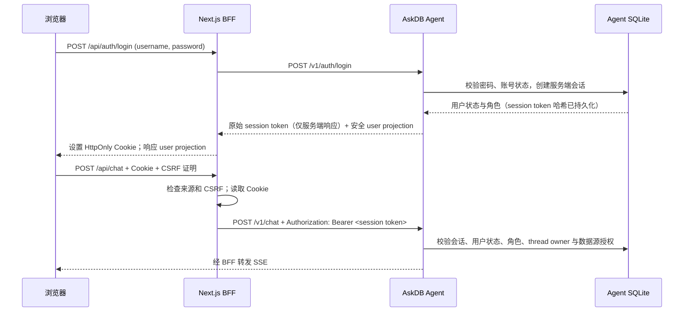

# AskDB 用户登录与权限设计

- 状态：设计已确认并作为本期实现基线
- 日期：2026-10-02
- 范围：`askdb-web/` 与 `askdb-agent/` 中的本地账号、登录会话、角色权限和按用户分配数据源

## 1. 背景与范围

AskDB 当前面向可信内网使用，没有用户身份或账号权限边界。Web 通过 Next.js BFF 向 Agent 转发聊天、模型设置和 Wren 数据源管理请求；Agent 当前将模型配置、数据源配置和 thread 到数据源的绑定保存在本地 SQLite 中。登录后，Agent 需要成为用户身份、角色和数据源授权的权威方，避免只在页面隐藏管理入口而留下可直接调用的 API。

本设计实现一个组织内的本地账号系统。它为未来的服务端会话记忆提供可信 `user_id` / principal 与 thread owner 校验基础，但不在此功能中保存或迁移对话正文、摘要或个人记忆。

### 1.1 已确认的产品决策

1. AskDB 服务一个组织，支持多位用户；不增加 tenant 概念。
2. 没有外部 SSO/IdP；AskDB 自己管理本地账号，不开放自助注册。
3. 首位管理员由部署人员通过一次性初始化流程建立；之后管理员创建账号。
4. 登录标识是管理员分配的用户名或工号。
5. 创建账号时生成一次性临时密码；用户首次登录必须先修改密码。
6. `admin` 管理账号、模型和数据源，并且可以聊天；`member` 只能聊天。
7. 管理员按用户分配可用数据源；可用指已启用且运行配置就绪。管理员本身可访问全部已启用数据源。
8. Agent 是认证、会话、角色和数据源授权的唯一权威方。Next.js BFF 负责浏览器 Cookie、CSRF 检查和请求转发，不自行声明用户身份。
9. 会话记忆按已确认的 Agent 记忆设计后续单独实施；此功能只提供可信身份及 thread owner 边界。
10. 当前是 demo 阶段，首期不实现 TOTP/MFA；部署按单 Agent 实例和 SQLite 设计。
11. 未登录阶段创建的匿名 thread 没有可信 owner，不自动认领或迁入用户账号。旧浏览器本地记录保留，但登录后的会话列表不展示。

### 1.2 非目标

- 企业 SSO、OIDC、SCIM、邮件邀请、自助注册或短信找回密码。
- TOTP、短信 MFA、WebAuthn 或其他第二因素。
- 本期服务端对话记忆、thread 正文迁移、摘要、个人偏好记忆或记忆审核。
- 行级、列级或表级授权。普通用户的授权粒度是数据源；具体可查询模型仍受 Wren MDL、只读 SQL 校验、`dry_plan` 和 `dry_run` 等既有安全门控制。
- 多租户隔离或多 Agent 实例下的分布式会话运行。

## 2. 角色和授权矩阵

| 能力 | `admin` | `member` |
|---|---:|---:|
| 登录、退出、查看自己的身份、修改自己的密码 | 是 | 是 |
| 聊天 | 是 | 是 |
| 可聊天数据源 | 全部已启用且配置就绪的数据源 | 管理员分配且已启用、配置就绪的数据源 |
| 查看安全的模型选择项 | 是 | 是，仅供聊天选择 |
| 创建/修改/禁用账号、重置临时密码 | 是 | 否 |
| 分配或撤销成员的数据源 | 是 | 否 |
| 创建/修改/删除模型配置 | 是 | 否 |
| 管理 Wren 数据源及 revision | 是 | 否 |

角色能力在 Agent API 层实施。隐藏 Web 导航或按钮只是界面行为，不能替代 Agent 端权限检查。账号采用禁用而非物理删除，以保留审计引用和稳定的 `user_id`。

## 3. 架构与信任边界

- 浏览器只访问同源 `/api/...`；不直接请求 Agent。生产环境中浏览器到 Web 使用 HTTPS，Web 到 Agent 的服务链路限制在可信网络并使用受保护传输。
- Agent 签发随机、不包含身份信息的高熵 opaque session token；SQLite 只存 token 的哈希。原始 token 只在 Agent 到 BFF 的后端响应中短暂传递，由 BFF 写入 Cookie；不得放进浏览器 JSON、localStorage、日志或 SSE。
- BFF 从 Cookie 读取 token 后，将其作为后端 `Authorization: Bearer` 转发给 Agent。Agent 不信任 `X-User-Id`、`X-Role`、客户端表单里的授权声明，也不从 `thread_id` 推断用户身份。
- Agent 在每个受保护请求中加载会话对应的当前账号状态、角色和数据源权限；禁用账号、角色调整和权限撤销立即影响后续请求。
- 公开健康探针只返回最小存活状态，不返回模型、数据源、用户或会话信息。登录 API 是唯一无需已有会话的用户 API；首位管理员初始化是 Agent 主机上的本地运维命令，不提供公开 HTTP bootstrap 接口。

## 4. 账号生命周期

### 4.1 初始化首位管理员

- 增加 Agent 主机上的一次性管理命令，例如 `uv run python -m askdb_agent.cli auth init-admin`。具体 CLI 名称在实现时按现有命令结构确定。
- 命令只在用户表从未有过账号时允许执行；账号已创建后，重复执行必须拒绝。禁用所有账号也不重新开放初始化。
- 命令交互收集管理员用户名或工号，并生成一次性临时密码。临时密码只在终端展示一次；用户首次登录必须修改密码。

管理员账号全部失效时，Agent 主机提供交互式 `auth recover-admin` 运维命令：按现有用户名或工号恢复账号为启用管理员、撤销该账号现有 session 并生成新的临时密码。此恢复能力只在 Agent 主机终端可用，不提供 HTTP 入口。
- 不设置默认用户名、默认密码、环境变量绕过或匿名管理页面。初始账号如需恢复，只能通过受控的主机运维流程。

### 4.2 管理员创建和管理账号

- 管理员在“用户管理”页面创建 `member` 或 `admin` 账号，并为 member 勾选可用数据源。
- Agent 生成随机临时密码，只在本次创建响应中返回；数据库只保存 Argon2id 哈希，不保存临时密码。若响应丢失，管理员可重新执行“重置临时密码”，而不能读取旧密码。
- 管理员可以改用户名、角色和数据源授权，重置密码，禁用账号和重新启用账号。账号禁用、密码重置或角色变化都会撤销该用户的所有现有会话。
- 禁用保留账号记录、稳定 `user_id` 和审计记录。撤销单项数据源授权无需注销用户，但 Agent 每次请求都必须重新检查授权。

### 4.3 用户登录和改密

1. 用户输入用户名/工号及密码。
2. 登录成功后，Agent 创建会话，Web BFF 设置 Cookie 并请求当前用户 projection。
3. 若账号带有 `must_change_password=true`，UI 进入强制改密页。Agent 也在 API 层限制该会话只能调用改密、查看必要的改密状态和退出接口；直接调用聊天或管理接口必须得到 `PASSWORD_CHANGE_REQUIRED`。
4. 改密成功后清除强制改密标志，并轮换当前会话 token；旧临时密码和旧会话不再有效。
5. 用户可在账号菜单中主动修改密码。用户忘记密码时由管理员重置为新的一次性临时密码；首期不设邮件找回或 MFA 恢复流程。

## 5. 密码、会话和 CSRF 安全

### 5.1 密码策略

- 只保存 Argon2id 密码哈希，不可逆加盐。OWASP 的基线建议为内存 19 MiB、迭代 2 次、并行度 1；实现可在目标运行环境压测后提高成本。
- 单因素密码至少 8 个字符，允许长口令和空格，至少接受 64 字符；只要求长度，不要求大小写、数字或符号组合，也不额外拦截常见密码。允许密码管理器自动填充和粘贴。密码字段默认掩码并可按需显示；首次登录强制改密时，临时密码字段不提供显示切换。
- 用户密码不定期强制过期；账号重置、泄露或安全事件才要求变更。
- 登录失败至少按规范化账号限流，并可结合可信来源地址渐进等待，不永久锁死账号。若 Web 部署在反向代理后，只接受明确配置的可信代理所提供的客户端地址，忽略用户自行提交的转发头。用户名不存在、账号禁用或密码错误时，浏览器得到相同的通用认证错误，避免枚举账号。
- 限流失败次数、密码、一次性密码、Cookie token、数据源连接密钥和聊天正文不得进入普通日志。

以上参数参照 [OWASP Password Storage Cheat Sheet](https://cheatsheetseries.owasp.org/cheatsheets/Password_Storage_Cheat_Sheet.html) 与 [NIST SP 800-63B-4](https://pages.nist.gov/800-63-4/sp800-63b.html)。

### 5.2 会话策略

- Cookie 名称建议 `__Host-askdb_session`，属性为 `Secure; HttpOnly; SameSite=Lax; Path=/`，不设置 `Domain`。生产部署必须 HTTPS；本地开发的 HTTP 例外必须限定为 loopback 开发环境。
- 会话 token 用密码学安全随机数生成，持久化其 SHA-256 哈希和必要元数据。由于 token 随机熵足够高，这里是 token 查找哈希，不是密码哈希。
- Agent 服务端执行 **30 分钟无操作过期**和 **8 小时绝对过期**；二者同时满足。浏览器 Cookie 作为非持久会话 Cookie。Agent 超时后拒绝请求；BFF 清理 Cookie 并引导重新登录。
- 退出当前会话时 Agent 撤销服务端 session，BFF 同时过期 Cookie。禁用账号、密码重置和角色变化撤销该用户全部 session。服务端撤销是权威动作，单纯清除浏览器 Cookie 不算登出。
- 只使用 Cookie 的状态变更接口由 BFF 校验 `Origin`，并要求 CSRF token/header；`SameSite=Lax` 作为额外保护，不代替 CSRF 校验。
- Session 生命周期属性参照 [OWASP Session Management Cheat Sheet](https://cheatsheetseries.owasp.org/cheatsheets/Session_Management_Cheat_Sheet.html)。

### 5.3 MFA

首期不实现 TOTP/MFA，符合当前 demo 阶段的范围决定。生产环境扩大使用范围时再单独评估管理员 MFA、注册、设备丢失恢复和 break-glass 管理流程；不得在本期中留下能静默绕过 MFA 的半成品开关。

## 6. 数据模型与持久化

demo 首期沿用当前 `ASKDB_SETTINGS_DB_PATH` 指向的 SQLite 文件，以避免额外部署存储；身份域使用独立表、repository 和应用服务，不将对话正文写入该文件。数据库目录和文件沿用当前本地存储权限保护。SQLite 方案要求单 Agent 实例运行。

建议表：

| 表 | 关键字段与用途 |
|---|---|
| `auth_users` | 稳定 `id`、显示 `username`、规范化且唯一的 `username_key`、`role`、`password_hash`、`is_active`、`must_change_password`、创建/更新时间、`last_login_at`。账号禁用代替删除。 |
| `auth_sessions` | `token_hash` 主键、`user_id`、创建/最近使用时间、`idle_expires_at`、`absolute_expires_at`、`revoked_at`。只存 token 哈希。 |
| `auth_user_data_sources` | `(user_id, data_source_id)` 唯一键、授权人、授权时间。仅 member 使用显式授权；admin 由服务端角色策略获得全部已启用源。 |
| `auth_login_throttles` | 账号/请求来源的限流窗口、失败次数及暂缓时间；仅保留限流所需的短期数据。 |
| `auth_audit_events` | actor、目标账号、操作类型、时间、request ID 和安全的变更摘要；禁止写密码、token、模型/数据源凭据或对话正文。 |

### 6.1 多实例边界

SQLite 文件方案是 demo 单实例约束，不应让多个 Agent 进程各自使用独立会话状态。若 AskDB 进入多 worker/多实例共享使用阶段，开放部署前先迁移到所有实例共享的事务数据库与共享限流存储，并执行并发登录、禁用、重置和撤权验证。会话正文仍由独立的记忆存储设计负责。

## 7. 数据源和 thread 授权

- `GET /v1/data-sources` 对 admin 返回所有数据源；对 member 只返回启用且已分配的数据源。聊天选择器与账号授权选择器只展示启用且运行配置就绪的数据源；配置写入和 Wren 管理接口仅 admin 可调用。
- Chat 请求中的 `data_source_id` 是选择提示，不是授权证明。Agent 必须在取得 runtime 前，按当前 principal 校验该 source 对用户可用。
- 第一次使用某个 thread 时，Agent 在同一事务内记录 `thread_id`、可信 `owner_user_id` 和绑定的 `data_source_id`。后续请求必须同时验证 thread owner 与当前 source 授权；thread 不能被客户端改绑到另一数据源。admin 的管理员策略允许访问全部已启用源。
- 为现有 `chat_thread_data_sources` 增加可空 `owner_user_id`。旧记录保持 owner 为空，不由第一个登录用户自动认领；携带旧 thread ID 的聊天请求要求新建会话，返回稳定错误 `CHAT_THREAD_LEGACY_REQUIRES_NEW_THREAD`。
- 新 thread ID 使用 Agent 返回的稳定 `user_id` 前缀和随机后缀；Agent 在查询 thread/source 绑定或获取 runtime 前校验命名空间。这样没有旧数据源绑定行、但仍留在既有 runtime checkpoint 中的匿名 thread 也不能被新账号认领；其他用户命名空间统一按不存在处理。
- Web 的本地 thread 存储按 `/api/auth/me` 返回的稳定 `user_id` 分区。登录账号 A 后不能显示账号 B 的本地会话；旧匿名 localStorage key 保留但不进入已认证会话列表。
- 本期没有 server-side chat message 表；`thread_id` 仍只是定位符，不是凭证。未来记忆 API 必须以 Agent principal 做 owner 查询条件，延续 [Agent 记忆体系设计](../../Agent记忆体系设计.md) 的信任和数据隔离规则。

数据源授权只有数据源粒度，不构成源内部的行级、表级权限。每个数据源仍须使用符合部署要求的只读数据库账号，SQL 安全门和 Wren MDL 仍然生效。

## 8. HTTP 契约与路由权限

浏览器只调用同源 `/api/...`。Next.js Route Handlers 显式执行 Cookie/CSRF 和请求代理；Agent 路由显式执行认证和授权。页面导航或 Next.js middleware 不能作为最终访问控制。

### 8.1 登录用户路由

| Web BFF | Agent | 权限 | 行为 |
|---|---|---|---|
| `POST /api/auth/login` | `POST /v1/auth/login` | 未登录、限流 | 校验用户名/密码；BFF 将 Agent 返回的 session token 转成 HttpOnly Cookie。 |
| `POST /api/auth/logout` | `POST /v1/auth/logout` | 登录用户 | 撤销当前 session 并清除 Cookie。 |
| `GET /api/auth/me` | `GET /v1/auth/me` | 登录用户 | 返回 `user_id`、用户名、角色、`must_change_password` 及必要 UI 能力标志；无敏感凭据。 |
| `POST /api/auth/change-password` | `POST /v1/auth/change-password` | 登录用户 | 修改密码并清除首次改密状态、轮换 session。 |

### 8.2 管理员路由

| Web BFF | Agent | 权限 | 行为 |
|---|---|---|---|
| `GET /api/admin/users` | `GET /v1/admin/users` | admin | 列出非敏感账号信息和分配的数据源。 |
| `POST /api/admin/users` | `POST /v1/admin/users` | admin | 建立账号并返回仅此一次的临时密码。 |
| `PATCH /api/admin/users/{user_id}` | `PATCH /v1/admin/users/{user_id}` | admin | 修改显示名/登录名、角色或 active 状态；权限变化撤销 session。 |
| `POST /api/admin/users/{user_id}/reset-password` | 同路径 | admin | 生成新的临时密码、设 `must_change_password` 并撤销全部目标 session。 |
| `PUT/DELETE /api/admin/users/{user_id}/data-sources/{source_id}` | 同路径 | admin | 分配或撤销一个数据源；新分配仅接受已启用且配置就绪的数据源。 |

### 8.3 聊天和配置路由

| Agent 路由 | admin | member |
|---|---|---|
| `POST /v1/chat` | 可调用，全部启用源 | 可调用，仅已授权源 |
| `GET /v1/data-sources` | 全部源 projection | 已授权源 projection |
| `GET /v1/chat/model-options` | 可读取安全选择项 | 可读取安全选择项，仅用于聊天模型选择 |
| `GET/POST/PUT/DELETE /v1/settings/models...` | 管理 | 禁止 |
| `GET/POST/PUT/DELETE /v1/settings/wren...` | 管理 | 禁止 |
| 数据源创建、更新、删除、revision 发布 | 管理 | 禁止 |

Agent 的现有模型设置、Wren 设置、数据源目录和聊天路由都必须进入一份明确的认证/授权矩阵；不得只保护新建的用户管理接口。Member 获取模型选项时只看到必要的名称/模型选择 ID，不接触凭据或可写设置接口。

未认证返回稳定 401；角色不足返回 403；不属于当前用户的 thread 可返回不泄露存在性的 404；禁用数据源和撤权返回稳定、无敏感细节的错误码。所有敏感读取与写入响应设 `Cache-Control: no-store`。密码、临时密码、session token、模型 API Key 和数据源 secrets 不进入响应日志。

## 9. Web 页面与交互

1. 未登录访问聊天页面时进入登录页；登录成功后再读取 `/api/auth/me`。
2. 首次登录根据 Agent 返回的 `must_change_password` 进入强制改密页，成功前不显示或启用聊天和管理功能。
3. 所有登录用户进入聊天界面；数据源选择器仅展示 Agent 返回的当前用户可用数据源。member 无可用源时展示无授权状态，不回退为全局默认源。
4. 管理员导航增加“用户管理”入口。创建/重置临时密码成功后仅显示一次，提供复制并提示管理员通过组织内部渠道交付；关闭页面后不可再读取该密码。
5. 用户管理页支持账号列表、创建、用户名/角色编辑、数据源分配、禁用/启用、重置密码。敏感操作提供明确的确认与成功/失败反馈。
6. 模型和数据源配置管理只对 admin 显示；服务端拒绝 member 对应 API 直接访问。
7. 退出操作先调用 BFF/Agent 撤销 session，再清理当前用户的内存态和当前用户的浏览器临时缓存，最后返回登录页。以 `user_id` 分区的本地 thread 数据只属于该账号。

UI 沿用 AskDB 当前 assistant-ui sidebar、Base UI Dialog 和中文交互规范。Web 权限门只改善导航体验；Agent 端仍是授权权威。

## 10. 实施迁移边界

1. 初始化 auth schema 和 `owner_user_id` 字段；旧 thread 行 owner 保持 `NULL`，不自动回填。
2. 增加 principal/session/security dependency，并保护 `/v1/chat`、所有 `/v1/settings/...` 与 `/v1/data-sources` 路由。Agent 启动若 auth schema 不可用则受保护服务失败关闭，不退回匿名模式。
3. 增加 Next.js auth BFF、Cookie 管理、CSRF 检查、登录/改密/用户管理页面和按 `user_id` 分区的 local thread 适配器。
4. 部署新功能后在 Agent 主机初始化首位管理员，再由管理员创建普通用户和授源。迁移期间不保留无身份访问保护的公开管理 API。
5. 保留匿名期的旧本地 thread 数据，不在账号登录后展示或自动绑定；用户从新 thread 开始。服务端仅有的数据源绑定记录继续保持未认领状态。

## 11. 验收条件

1. 首位管理员初始化命令只能成功一次；没有内置默认凭据、匿名 setup API 或自助注册。
2. 管理员创建账号时只能看到一次临时密码；数据库只含 Argon2id 哈希；首次登录前不能聊天或调用管理操作。
3. 登录、退出、改密、禁用、重置、角色改变及 30 分钟 idle / 8 小时 absolute 过期均由 Agent session store 验证，重启 Agent 后状态仍有效或已撤销。
4. 伪造 `X-User-Id`、`X-Role`、`data_source_id` 或其他客户端身份字段不能提升权限；Agent 从 session 恢复 principal。
5. member 只能列出并访问被分配且启用的数据源；新增授权只能指向已启用且配置就绪的数据源。请求未分配源、访问管理接口或读写模型/Wren 配置均被 Agent 拒绝。
6. admin 可管理账号、模型、数据源并聊天；其聊天经过同样的 thread 绑定与 Wren/SQL 安全门。
7. 撤销数据源授权后，对同一 thread 的下一请求立即失败；thread owner 不匹配不得读取或继续其他用户的 thread。
8. 未登录 legacy thread 不会被新账号接管；旧 localStorage 内容不出现在新认证用户的会话列表；两个用户的新本地记录互相隔离。
9. 登录失败限流有效，认证错误不泄露用户名是否存在。Cookie 含 HttpOnly/Secure/SameSite 属性，状态变更请求通过 Origin 和 CSRF 校验。
10. 会话 token、密码、临时密码、数据源/model secrets、聊天正文不出现在普通日志、错误响应、浏览器 JSON 或 localStorage。
11. 现有模型/Wren/数据源设置 API 的每条 route 都有明确测试覆盖：admin 通过，member/匿名被拒绝，安全读取 projection 不回传任何 credential。
12. demo 仅单 Agent + SQLite；多实例部署未经共享会话数据库和限流能力验证不得开放。

## 12. 主要风险和边界

- SQLite 文件丢失会同时影响 demo 用户账号、会话和现有模型/数据源配置；部署备份要沿用当前 Agent SQLite 运维策略。会话记录可过期后重新登录，账号密码不可从数据库恢复，首位管理员恢复依赖受控主机流程。
- TOTP 首期不启用意味着管理员暂时只有密码防护；只适用于当前受控 demo 边界。扩大到生产访问前应重新评估管理员 MFA 和恢复流程。
- 数据源级授权不限制数据源内可查询的表/行。若业务要求更细隔离，应通过只读 DB 账号、独立 Wren 模型或另行设计的细粒度授权实现，不能依赖提示词。
- 浏览器本地对话数据仍由浏览器存储；本期按 user_id 隔离 Web 可见范围，但它不是服务端加密记忆或跨设备记忆。用户退出后共享设备的操作系统账号仍应受保护。

## 13. 参考资料

- [OWASP Password Storage Cheat Sheet](https://cheatsheetseries.owasp.org/cheatsheets/Password_Storage_Cheat_Sheet.html)
- [NIST SP 800-63B-4](https://pages.nist.gov/800-63-4/sp800-63b.html)
- [OWASP Session Management Cheat Sheet](https://cheatsheetseries.owasp.org/cheatsheets/Session_Management_Cheat_Sheet.html)
- [OWASP CSRF Prevention Cheat Sheet](https://cheatsheetseries.owasp.org/cheatsheets/Cross-Site_Request_Forgery_Prevention_Cheat_Sheet.html)
- [Next.js Authentication Guide](https://nextjs.org/docs/app/guides/authentication)
- [Next.js Backend for Frontend Guide](https://nextjs.org/docs/app/guides/backend-for-frontend)
- `docs/Agent记忆体系设计.md`
- `docs/Agent架构骨架与开发规范.md`
- `docs/superpowers/specs/2026-10-02-global-model-settings-design.md`
