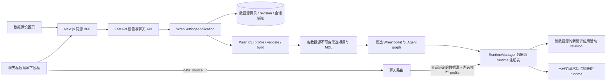

# AskDB Wren 配置页面设计

- 状态：用户已确认首期覆盖 Wren 0.15 数据库/数仓连接器，按连接器注册表实施
- 日期：2026-10-02
- 范围：`askdb-web/`、`askdb-agent/` 中的部署级多数据源目录、Wren 多连接器配置、会话数据源绑定、版本构建和 Agent runtime 路由

## 1. 背景

AskDB 当前从 `WREN_PROJECT_DIR` 和 `WREN_PROFILE` 环境变量读取一个 Wren 项目与 profile。Agent 使用 `WrenToolkit.from_project()` 加载显式绑定 profile 的项目；项目必须包含 `wren_project.yml` 和 `target/mdl.json`。目前准备连接、调整 models/views/relationships、校验并构建 MDL 的主要入口是 Wren CLI。新方案把部署级单项目扩展为多个具名数据源；每个数据源有独立连接、语义配置、revision 和 runtime，会话选择其中一个数据源查询。

Web 已有部署级模型设置入口、同源 Next.js BFF 和 FastAPI 设置 API。Wren 页面应沿用这条 Web → BFF → Agent 路径。Wren CLI 0.15.0 提供 `profile add --ui`、`profile add --from-file`、`context validate` 和 `context build`；其中内置浏览器表单负责连接 profile，不覆盖 AskDB 所需的模型、关系、规则和生效流程。

## 2. 目标与非目标

### 目标

1. 用户在 AskDB 页面配置 Wren 支持的数据库/数仓连接、业务模型、关系和业务规则。
2. 用户可配置多个数据源，在聊天输入框选择数据源；每个会话固定归属一个数据源，左侧会话列表显示其数据源。
3. 页面提供每个数据源的连接测试、表结构读取、校验结果、构建进度和当前生效版本。
4. 连接密码只由服务端管理，不能从读取接口、错误、日志或前端持久化中取回。
5. 校验、构建或候选 runtime 初始化失败时，该数据源当前生效项目和聊天请求继续可用。
6. 成功应用后，新聊天请求使用新 runtime；已开始的请求继续使用其捕获的旧 runtime。
7. 保留既有 FastAPI、LangGraph、WrenToolkit、聊天 SSE 和 SQL 查询门禁。

### 非目标

- V1 不提供多租户、每用户配置或应用登录。
- V1 支持多个独立 Wren 项目/连接，并支持在聊天中选择一个数据源；单个会话只查询其绑定的数据源，不做跨数据源 JOIN 或联邦查询。
- V1 支持当前锁定的 Wren 0.15 数据库/数仓连接器：PostgreSQL、MySQL/MariaDB、BigQuery、Snowflake、ClickHouse、Trino、SQL Server、Databricks、Redshift、Oracle、Athena、Spark、DuckDB 和 Apache Doris。文件连接器（本地文件、S3、GCS、MinIO）及 Wren 内部服务型 connector 不属于本轮范围。
- 连接字段和认证变体从锁定版本 Wren 的 connection schema 生成；连接测试、profile 序列化、元数据读取分别通过 connector registry 和 schema reader adapter 处理，不在 Web/API 中复制某一种数据库的字段结构。
- V1 按单 Agent 进程部署；多 worker 下的配置广播和 runtime 一致性暂不支持。
- V1 不把 AskDB 运行时切换到 Wren MCP；当前运行链路继续使用 WrenToolkit。
- V1 不把业务规则文本当作行级/列级权限控制，也不允许页面任意执行 SQL。
- V1 不提供任意 YAML 文件编辑器；高级视图 SQL 使用明确的 SQL 编辑区。

## 3. 范围和决策

### 用户已认可的范围

- 单部署内可配置多个数据源，每个数据源拥有独立 Wren 项目、profile、语义模型和 revision；同一部署可以混用上述不同连接器。
- 新会话可在聊天框的数据源下拉框中选择数据源；首条消息发出后会话绑定该数据源，左侧会话列表显示数据源名称。
- 页面按数据源管理数据库连接以及对应的业务模型和规则。
- 用户已授权执行；本次范围修订将 MySQL 专用实现扩展为多连接器实现。

### 本设计采用的技术决策

1. Wren CLI 保留为 Agent 服务端的 profile 管理、项目校验和 MDL 构建工具；浏览器只提交结构化表单数据，不提交 shell 命令或文件路径。
2. 数据源有稳定 ID 和可修改显示名称；每个数据源区分草稿版本与生效版本。Agent 在独立、不可变的版本目录构建候选项目，成功后只更新该数据源的活动版本。
3. 每个候选 revision 使用独立的 Wren profile 名称，候选项目的 `wren_project.yml` 显式绑定该 profile；profile 命名空间包含数据源和 revision。
4. 每个数据源对应一个 Wren toolkit；Agent graph 还取决于当前会话选择的模型 profile 和 Wren 活动 revision。`RuntimeManager` 维护按 `(data_source_id, wren_revision_id, model_profile_id, model_profile_revision)` 索引的不可变 runtime 注册表，聊天请求捕获对应 runtime 快照。
5. LLM 模型 profile 继续沿用现有部署级 profile 目录并允许会话选择；更新一个数据源只重建该数据源的 graph，更新一个模型 profile 只失效该 profile 对应的 graph，不影响其他数据源或模型 profile。
6. 新会话创建时选择数据源，首条消息后数据源绑定不可变；原有模型 profile 的会话选择能力保留。切换数据源需新建会话，防止历史消息、工具结果和上下文跨数据库混用。
7. 设置作用于整个 AskDB 部署。所有能访问设置页的用户都能更改此配置；网络访问仍限可信内网并使用 HTTPS。
8. 只读能力由各数据源的只读账号权限、只读角色或只读视图落实。业务说明和提示规则只是 Agent 指导信息。

## 4. 页面流程与状态

在侧栏设置菜单中增加“Wren 数据源”，打开数据源目录页。目录支持创建、编辑、启用/停用数据源；进入单个数据源后，分为连接、模型、关系、业务规则和应用预览五个区域。模型提供方仍使用现有部署级设置。

聊天输入框上方/附近提供数据源下拉框，显示已启用数据源的名称和连接状态。新会话可以选择任一可用数据源；首条消息发送后，下拉框变成该会话的数据源只读标识。需要查询另一个数据源时创建新会话并选择它。侧栏会话项在标题旁显示数据源徽标；数据源被停用或删除保护时，原会话仍显示原名称并标记“不可用”。

用户可为部署指定默认数据源。新会话默认选中该数据源，但用户可以在首条消息前改选。只有启用且有活动 runtime 的数据源可设为默认或出现在可选项中；没有可用默认数据源时，必须先选择一个数据源才能发送。

### 4.1 数据源连接

- 数据源目录字段包含稳定 `id`、显示名称、connector 类型、启用状态、活动/草稿 revision 和最近操作状态。已创建的数据源 connector 类型不可编辑；更换类型时创建新数据源。
- 创建数据源时先选 connector，再按当前锁定 Wren 版本提供的字段、默认值、必填状态、别名、敏感字段和认证变体生成表单。BigQuery、Databricks、Redshift 等多认证变体提供独立字段组。
- 敏感字段统一由字段 schema 识别并加密保存；留空表示保留已保存密钥。读取设置只返回非敏感字段与 `configured_secret_fields`，不返回凭证值。
- “测试连接”使用候选 profile 检查连接；失败时显示脱敏后的错误，并保留草稿。
- 测试结果绑定连接字段摘要；修改 host、database、user、SSL 或密码后，之前的成功结果失效。
- “读取表结构”通过对应 connector 的元数据适配器读取 catalog/schema/table/column/key 元数据，不读取业务行。特殊命名空间由 connector adapter 显式处理，发现失败不能退化为读取业务行。
- 用户选择要纳入语义层的表。数据库身份必须使用只读账号。
- 停用数据源会阻止新会话选择和旧会话继续发送，但保留其配置、revision 和会话归属；已被会话引用的数据源不能硬删除。删除只允许对未被任何会话引用的数据源执行，或通过停用与保留的软删除流程。

### 4.2 业务模型

- 为所选表生成或更新 Wren model。
- 支持配置模型名称、显示名称、模型描述、字段描述、字段可见状态和主键。
- 编辑模型前展示来源表与字段列表，区分数据库物理名称和 Agent 查询时使用的 MDL 名称。
- 保存更改只更新草稿，不立即改变聊天使用的 MDL。

### 4.3 关系和业务规则

- connector 提供外键元数据时列出关系建议；未提供外键信息的连接器允许用户手动配置关系。用户可确认、编辑或删除建议关系。
- 关系表单表达来源模型/字段、目标模型/字段、基数和连接条件。
- 业务规则区编辑指标口径、时间口径、术语和问数约束；视图 SQL 放在高级区。
- AskDB 现有确定性 SQL 策略继续独立执行。页面上任何提示词或规则都不能放宽该策略。

### 4.4 预览与应用

- 页面列出与当前生效版本相比的模型、字段、关系和规则变更。
- operation 状态统一为 `draft`、`testing_connection`、`introspecting`、`validating`、`building`、`initializing_runtime`、`active` 或 `failed`；目录还需表达 `enabled` / `disabled`，避免把数据源可用性和 revision 构建状态混成一个字段。
- 只有候选 profile 测试、项目校验、MDL 构建和候选 runtime 初始化全部成功后，才能显示 `active`。
- 失败时展示阶段、稳定错误码和可读说明；不展示凭证、原始上游错误正文或敏感 SQL。
- 展示最近生效 revision 和可回滚版本。回滚只重新激活已构建且仍保留的成功版本。

## 5. 架构



### Web

- 设置页和数据源目录通过同源 Next.js Route Handlers 访问 Agent，不直连 Wren CLI、数据库或 profile store。
- 复用当前设置页的按钮、表单、反馈和无缓存处理方式。
- 密码只存在当前输入控件内存中，提交后清空；不写 localStorage、URL、客户端日志或分析事件。
- 会话适配器在本地 thread metadata 中保存 `dataSourceId`，作为侧栏徽标和 composer 当前选择的显示来源；Agent 同时在 SQLite 维护不可变的 `thread_id → data_source_id` 绑定，拒绝同一会话改绑。

### Agent 模块

- `api/routes/wren_settings.py`：数据源目录/设置 HTTP 路由和错误码映射。
- `api/schemas/wren_settings.py`：数据源、revision 请求/响应 schema、字段约束和 `extra="forbid"`。
- `application/wren_settings.py`：数据源创建、草稿、profile 测试、schema 导入、validate/build/apply/rollback 的用例编排。
- `integrations/wren_cli.py`：执行 Wren CLI 固定子命令，管理候选 project/profile，捕获并脱敏输出。
- `integrations/wren_connectors.py`：从锁定 Wren 版本生成连接器目录、表单字段、敏感字段清单和 profile 字段映射。
- `integrations/schema_readers/`：为首期数据库/数仓连接器提供连接探测和 metadata-only schema 读取适配器。
- `wren_settings.py`：SQLite 数据源目录、source-scoped revision 状态、会话绑定、密文读写和迁移。
- `runtime.py` / 新增 `application/runtime_manager.py`：维护 `(data_source_id, wren_revision_id, model_profile_id, model_profile_revision) → runtime snapshot` 注册表；组合当前模型 profile 与对应 Wren revision，并按 source 或模型 profile 原子失效/切换。

进程执行 CLI 时使用参数数组，不使用 `shell=True`；工作目录和 `WREN_HOME` 由 Agent 配置确定。CLI 超时、崩溃或错误输出都不能改变活动 revision。

Agent 启动时先加载部署环境并确定 `WREN_HOME`，之后再导入 Wren 包；Wren 当前会在模块加载时读取该路径。CLI profile 校验输出包含驱动错误，不能原样返回或记录。

## 6. API 契约

设置请求走 `/api/settings/wren/*`，由 BFF 转发到 Agent 对应的 `/v1/settings/wren/*`；聊天选择器走 `/api/data-sources`。设置响应和目录响应使用 `Cache-Control: no-store`。

| Web / Agent 路由 | 用途 |
|---|---|
| `GET /data-sources` | 返回所有数据源的安全摘要供侧栏徽标解析；composer 过滤为 enabled 且 runtime ready 的数据源 |
| `GET /settings/wren/connectors` | 返回锁定 Wren 版本提供的数据库/数仓连接器、认证变体与表单字段定义 |
| `GET /settings/wren/data-sources` | 返回数据源目录和部署默认数据源 |
| `POST /settings/wren/data-sources` | 创建数据源及初始草稿 |
| `GET /settings/wren/data-sources/{source_id}` | 读取单个数据源脱敏配置、活动/草稿 revision 和已配置密钥字段名称 |
| `PUT /settings/wren/data-sources/{source_id}` | 更新显示名称、连接或语义草稿，不立即应用 |
| `POST /settings/wren/data-sources/{source_id}/connection/test` | 验证该数据源草稿连接，不切换 runtime |
| `POST /settings/wren/data-sources/{source_id}/schema/refresh` | 读取该数据源 schema 元数据并返回可选择表和字段 |
| `POST /settings/wren/data-sources/{source_id}/apply` | 创建 operation，后台构建并准备该 source 的候选 runtime |
| `GET /settings/wren/operations/{operation_id}` | 查询带 `data_source_id` 的 operation 阶段和脱敏诊断 |
| `POST /settings/wren/data-sources/{source_id}/rollback/{revision_id}` | 只回滚该 source 的活动 revision |
| `POST /settings/wren/data-sources/{source_id}/deactivate` | 停用数据源并保留其历史会话归属 |
| `PUT /settings/wren/default-data-source` | 设置或清除部署默认数据源 |

聊天 API 现有请求新增可选 `data_source_id`（旧客户端兼容期可省略）。Agent 用该 ID 查询活动目录，不接受浏览器传入项目路径、profile 名或连接配置；首次收到 `thread_id` 时记录绑定，后续请求必须匹配已记录的数据源。

### 6.1 读取响应

```json
{
  "data_source": {
    "id": "ds_01J9WREN7M2",
    "display_name": "分析库",
    "connector_type": "mysql",
    "enabled": true,
    "active_revision_id": "rev_20261002_001",
    "draft_revision_id": "rev_20261002_002",
    "status": "draft"
  },
  "connection": {
    "host": "db.internal",
    "port": 3306,
    "database": "analytics",
    "user": "askdb_readonly",
    "configured_secret_fields": ["password"]
  }
}
```

密码和密文永不出现在响应中。API 不接受项目目录、profile 文件路径或任意 CLI 参数。

### 6.2 应用操作

`POST /settings/wren/data-sources/{source_id}/apply` 返回 `202`、`operation_id` 和 `data_source_id`。浏览器轮询 operation 路由展示阶段。失败码至少区分 `DATA_SOURCE_NOT_FOUND`、`DATA_SOURCE_UNAVAILABLE`、`DATA_SOURCE_REQUIRED`、`WREN_CONFIGURATION_INVALID`、`WREN_CONNECTION_FAILED`、`WREN_SCHEMA_DISCOVERY_FAILED`、`WREN_VALIDATION_FAILED`、`WREN_BUILD_FAILED`、`WREN_RUNTIME_INIT_FAILED`、`CHAT_DATA_SOURCE_MISMATCH`、`WREN_SETTINGS_UNAVAILABLE`。

更新失败时该 source 的草稿保留、活动版本不变，其他 source 继续服务。配置输入错误返回 `422`；SQLite/加密存储不可用返回 `503`；Wren CLI 错误映射为可操作的脱敏消息。

### 6.3 聊天选择与会话绑定

```json
{
  "thread_id": "thread_abc",
  "data_source_id": "ds_01J9WREN7M2",
  "model_profile_id": "default",
  "messages": []
}
```

- `GET /api/data-sources` 只返回 `{id, display_name, connector_type, enabled, runtime_status}` 等安全字段，不暴露 host、database、用户名或凭证。响应包含已停用 source 的安全摘要供旧会话侧栏显示；composer 只展示 enabled 且 runtime ready 的选项。
- 创建空白会话时，composer 默认选择部署默认数据源；用户可在首条消息前切换。发送第一条消息后将 ID 写入浏览器 thread metadata，选择器变为只读标识。
- Agent 对 `thread_id → data_source_id` 做 SQLite insert-if-absent；并发首发只允许一个 source 成为绑定值。已有绑定时优先使用绑定值，显式传入不同 source 则在 SSE 响应开始前返回 `CHAT_DATA_SOURCE_MISMATCH`，不执行工具。新会话首次请求省略 ID 时才回退到部署默认 source；没有默认 source 则返回 `DATA_SOURCE_REQUIRED`。
- 老会话迁移时，前端把缺失的 `dataSourceId` 补成旧单数据源导入出的默认 source；Agent 有会话绑定记录时以服务端记录为准。若没有可用默认 source，则保留历史消息但要求用户选择，且在首次成功发送前不展示为已绑定。
- source 被停用或 runtime 暂不可用时，不自动改投其他 source；会话保留原徽标和本地历史，发送明确失败状态。

## 7. 持久化、凭证与版本目录

### 7.1 SQLite

复用 `ASKDB_SETTINGS_DB_PATH` 下的服务端 SQLite，并沿用 `ASKDB_SETTINGS_ENCRYPTION_KEY` 的 Fernet 加密能力。新增逻辑表：

- `wren_state`：部署默认 `data_source_id`、更新时间和必要的迁移状态。默认值必须引用 enabled 且有活动 runtime 的 source。
- `wren_data_sources`：稳定 ID、显示名称、connector 类型、启用/停用状态、活动/草稿 revision ID、创建和更新时间。
- `wren_revisions`：以 `source_id + revision_id` 标识的状态、非敏感表单配置、项目目录、profile 名称、MDL 摘要、错误码和时间戳。
- `wren_secrets`：按 `source_id + revision_id + secret_name` 存储加密后的连接密码/CA 内容。
- `wren_operations`：operation ID、`source_id`、阶段、状态、revision、脱敏错误和更新时间。
- `chat_thread_data_sources`：`thread_id` 唯一绑定的 `data_source_id` 和创建时间；以唯一约束及事务实现 insert-if-absent，阻止同一会话并发请求绑定到不同数据源。

备份时同时保护 SQLite 文件和 Fernet 密钥。数据库记录已有密文但 Fernet 密钥不可用时必须失败关闭，不回退到环境变量或旧 profile。

### 7.2 Wren profile

- Agent 使用专用持久化 `WREN_HOME`，不复用开发人员的个人 `~/.wren`。
- 每个数据源的每个 revision 使用独立 profile 名称，名称由服务端生成并包含安全 source/revision token，避免修改 profile 内容后影响已运行的旧 toolkit。
- `profiles.yml` 只保存 `${ASKDB_WREN_{SOURCE_TOKEN}_{REV_TOKEN}_{FIELD_TOKEN}}` 形式的变量引用；密文保存在 SQLite。每个敏感字段有独立、服务端生成的变量名，不接受用户提供的环境变量名。运行时从 SQLite 解密到 Agent 进程环境供 Wren 连接层按需解析。
- revision profile 通过 Wren CLI `profile add --from-file --no-validate` 创建。输入文件只包含变量引用，采用 `0600` 临时权限并立即删除。CLI profile store 保持 `0600`。
- 连接探测由 Wren 0.15.0 connector registry 对候选连接执行固定的 `SELECT 1`。profile CLI 的验证失败会以 warning 报告且可能仍保留 profile，因此不得仅凭 `profile add` 进程退出码判定连接成功。
- 测试失败时删除候选 profile；构建失败时保留 draft，清理不再引用的 profile。profile 清理不能早于旧 runtime 和在途请求释放该 revision。
- 首次迁移把当前 `WREN_PROJECT_DIR` 和显式 `WREN_PROFILE` 导入为一个具稳定 ID 的默认数据源。Agent 将该 profile 导入专用 `WREN_HOME`；字面凭证及已解析的环境变量引用加密进 SQLite，并替换成新环境变量引用。缺少的变量引用导致迁移停止，旧 profile 和 runtime 保持可用。迁移成功后新目录成为唯一运行时 profile store，老会话归属该导入的数据源；迁移失败时保留旧配置并报告未完成，不切断旧 runtime。

Wren CLI 的 profile 实现支持 `${VAR}` 延迟解析、独立 `WREN_HOME` 和 `0600` profile 文件；环境变量在建立连接时解析，而非保存 profile 时解析。

### 7.3 项目文件和产物

- 草稿表单作为结构化 revision 存储。
- 应用时在 `ASKDB_WREN_DATA_DIR/sources/{source_id}/revisions/{revision_id}/` 生成 `wren_project.yml`、`models/`、`views/`、`relationships.yml`、`knowledge/` 和 `target/mdl.json`。
- 构建 revision 目录构建完成后保持不可变；不能在 Agent 已加载的项目目录原地编辑。
- 保留活动版本和最近 3 个成功版本；未生效草稿与失败候选按可配置保留期清理。
- 版本目录和 SQLite 位于持久化卷；版本目录不包含数据库凭证。
- 若尚无 Wren 数据源记录，Agent 首次启动从现有 `WREN_PROJECT_DIR`、`WREN_PROFILE` 读取项目实际声明的 connector，初始化默认 source 的活动 revision，保留当前问数链路。SQLite 一旦有数据源记录，后续启动按 source 恢复注册表；任一活动 revision 或凭证无法恢复时，明确标记该 source 不可用，不得静默把它路由到另一个 source 或回退到 `.env`。其余可恢复 source 可继续提供服务。
- Agent 单进程启动时逐一恢复活动 revision 和最近保留版本所需的加密凭证。旧 revision 的凭证只在其 runtime 和在途请求不再使用后清理。

## 8. Apply 与 runtime 一致性

1. 获取进程内 apply 锁；V1 先串行化所有 source 的 apply 操作，避免共享 `WREN_HOME` profile 写入冲突。单 Agent 进程是该锁与内存 runtime 注册表的部署前提。
2. 校验草稿 schema，并为本次 revision 准备唯一 profile。
3. 测试连接；只执行连接探测，不查询业务表数据。
4. 通过只读元数据连接读取 schema；将选定的模型和关系生成至 revision 目录。
5. 在 revision 目录运行 `wren context validate` 和 `wren context build`。
6. 使用新 project 路径和显式 profile 名创建 `WrenToolkit`，并用当前全局模型配置构造该 source 的候选 graph。
7. 在短暂的 runtime swap 锁内，先持久化成功状态与该 source 的活动 revision ID，再以 copy-on-write 方式替换注册表中的单个 source；聊天请求取得快照时也使用该锁。SQLite 写入失败时保留旧注册表。长时间的 CLI build 不持有 runtime swap 锁。
8. 返回成功状态；Web 只更新该 source 的活动 revision。

聊天路由先校验并读取会话的 `data_source_id` 绑定，再在 SSE 开始前获取该 source/model profile runtime lease；流结束或取消时释放 lease。apply 不改变已获得快照的请求；后续该 source 的新请求获取新 runtime。profile、项目目录和凭证的清理必须等待旧 runtime lease 归零。一个 source 的构建失败、停用或 runtime 不可用不影响其他 source。服务重启时，若 operation 仍处于执行状态，将其标记为 `WREN_OPERATION_INTERRUPTED`；启动流程按 SQLite 中每个 source 最后提交的活动 revision 重建 runtime。若任一步骤失败，清理可删除的候选资源，保留旧注册表项和旧活动 revision。

模型 profile 保存也必须委托给同一个 `RuntimeManager`：以“新模型 profile + 每个 source 当前 Wren revision”准备对应 graph，只切换该模型 profile 的缓存条目；不得重置其他模型 profile 或 source 的 runtime。数据源 apply 则只更新该 source 下受影响的模型 profile 条目。

## 9. 安全与权限

- Web 设置、聊天入口和 Agent API 仅允许从可信内网访问；浏览器到反向代理使用 HTTPS。当前无应用身份认证，任何可访问该部署的用户都能改全局 Wren 设置。
- 浏览器不连接数据库或 Wren CLI；Agent 不把密码写进日志、响应、错误正文、事件追踪或项目 YAML。
- Wren CLI subprocess 的 stderr/stdout 在记录或返回前脱敏；不记录连接表单请求体。
- 连接测试使用候选 profile，不改变活动配置。
- 生产数据库 profile 必须使用数据库层只读账号。当前文档记载 `prod-ro` profile 实际使用 `root`，只读 grants 尚未确认；部署验收前需完成此项核查。
- 行级或列级隔离通过各数据库的视图、只读角色和 grants 等数据库边界执行。业务规则/模型描述不作为授权机制。

## 10. 验收条件

1. 用户可以从 Wren 0.15 的全部数据库/数仓连接器中选择类型，并至少创建两种不同类型的数据源；每种类型都能完成连接测试、schema 读取和 Wren runtime 初始化，不需要手工运行 CLI 命令。
2. 每个数据源独立编辑模型、字段描述、隐藏字段、关系和业务规则，并显示各自的草稿/活动版本差异。
3. 新会话的聊天输入框提供数据源下拉框，可选择任一 enabled 且 runtime ready 的 source；没有可用 source 时禁止发送并提示去配置。
4. 第一条消息发送后会话绑定所选 source，composer 显示绑定 source；更换 source 需要新建会话。Agent 对改绑请求返回 `CHAT_DATA_SOURCE_MISMATCH` 且不执行工具。
5. 左侧每个会话显示其 source 名称徽标；停用的 source 历史会话仍显示原 source 名称和不可用状态。
6. 表单加载不回显密码；空密码按保留处理；API、日志、CLI 日志和项目文件都不包含密码明文。
7. 无效连接、schema 读取失败、Wren validate/build 失败和候选 runtime 初始化失败都有可区分、脱敏的阶段状态，且失败只影响对应 source。
8. 任一 source apply 阶段失败时，该 source 旧活动配置和正在运行的聊天保持可用，其他 source 继续可用。
9. 成功 apply 后所选 source 的新请求使用新 revision；apply 前已开始的流式请求继续使用捕获的旧 runtime。
10. Agent 重启后能从 SQLite、WREN_HOME 和版本目录恢复所有可用 source 的活动 revision；密钥缺失时对应 source 失败关闭且不会路由到其他 source。
11. 能够按 source 回滚到最近保留的成功 revision；清理不会删除活动 revision 或仍被在途 runtime 使用的 profile。
12. SQL 查询门禁和 Wren `dry_plan` / `dry_run` / `query` 执行顺序保持不变。
13. 部署配置要求用户提供数据库层只读账号；连接成功不能被 UI 描述成已证明只读权限。

## 11. 范围外与后续扩展

- 文件类连接器（本地文件、S3、GCS、MinIO）、多租户凭证隔离和跨数据源 JOIN 后续单独设计；新增连接器必须同时具备表单 schema、连接探测、metadata reader、profile 序列化和 SQL 方言策略，不应只开放类型下拉框。
- 多环境、用户级凭证和权限审批需要独立的身份与授权模型。
- 数据库权限治理、审计、行级身份传递与列级脱敏需要独立设计，不应混入 V1 业务规则编辑器。
- MCP refresh 仅在 AskDB 后续实际采用 Wren MCP 时纳入；本设计中的生效边界是 Python Agent runtime 替换。

## 12. 自查

- V1 connector 范围与 Wren 0.15 锁定依赖一致，并明确排除文件类连接器和内部服务型 connector。
- 页面草稿、Wren profile、MDL 构建物和 Agent runtime 的版本关系保持一致。
- 失败路径明确保留旧活动 runtime；保存与生效状态没有混淆。
- 当前 Wren CLI 的 profile 表单能力不被描述为完整的 AskDB Wren 配置页面。
- 本文是设计文档，不包含代码实现或运行验证结果。

## 13. 参考

- [Wren Connect guide](https://github.com/Canner/WrenAI/blob/main/docs/core/guides/connect.md)：profile 创建、导入和项目绑定。
- [Wren operational reference](https://docs.getwren.ai/oss/reference/operational)：`WREN_HOME`、profile 文件权限和环境变量密钥引用。
- [Wren LangChain SDK](https://docs.getwren.ai/oss/sdk/langchain)：`WrenToolkit.from_project()` 对已准备项目及显式 profile 的使用方式。
