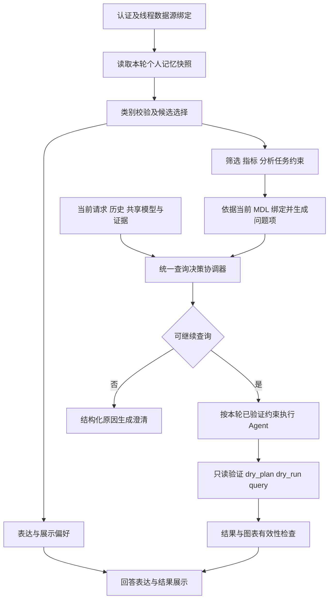

# 个人记忆与查询决策的架构评审

日期：2026-10-07。状态：用户已确认并实施核心契约，实施计划见 `../plans/2026-10-07-personal-memory-contract.md`。云模型、真实数据与浏览器效果待用户复测。

## 1. 目标、事实与约束

用户目标：从系统职责和契约保障长期稳定，避免针对每条漏网记忆增加分支补丁。

已确认事实：用户只有一条展示记忆“用中文说明”；开启时后端读到一条候选，`personal_match_result.clarification=true`，随后 `personal_short_circuit`；关闭时进入 Query Gate，返回 READY，并成功查询。两轮问题、业务上下文、模型版本、数据源 revision、共享召回指纹一致，history_count 均为 0。

已确认约束：保留认证、线程数据源绑定、Wren 只读安全链、版本隔离、turn 与 lease 收尾；保留个人记忆六类产品能力；不建立大型评测矩阵、新发布门禁或额外审批系统。以下模块、类型和迁移方式属于建议，不代表用户已批准实现。

## 2. 根因与当前边界缺口

| 当前证据 | 结构性缺口 | 后果 |
|---|---|---|
| `domain/personal_memory.py` 的 MemoryInput 使用通用 `payload: dict`，只检查所有类别共享的键集合 | 类别不能约束其影响范围，嵌套值缺少类别专属校验 | 标为 display 的记录也可携带 filters/metric；仅按 kind 分支仍不够 |
| `application/personal_memory.py` 将六类候选交给同一次匹配，模型返回自由文本 clarification 即提前退出 | 匹配器同时承担相关性判断、业务绑定和终止决策 | 语言偏好能阻断业务查询 |
| 初次匹配不接收当前 MDL 或共享参考，后续绑定才加载字段 | 在证据到齐之前做最终决定 | 本可以绑定的字段被提前要求澄清 |
| `state['context']` 包含所有已选记忆的正文和 payload；`application/chat.py` 将其提供给 Gate 与 Agent | 展示、方法和已验证查询约束没有独立投影 | 即使限制提前返回，仍可能通过上下文影响查询审查 |
| `personal_state` 为跨阶段可变字典，QueryArtifactContext 通过动态属性增加约束、展示和分析信息 | 无法由类型说明什么已验证、什么允许执行、谁有权改状态 | 生产方与消费方可逐渐产生不同理解 |
| `personal_memory_query.py` 对有限 SQL 子集检查筛选和直接聚合 | 有执行保护，但结构检查不能证明完整业务语义，也没有每个分析步骤的约束契约 | 不应把列存在或聚合出现等同于口径正确 |

既有设计文档第 7 节已要求“普通表达偏好不参与业务资格判断”。此次缺陷说明文档意图尚未成为代码接口、投影和验证规则。

## 3. 选择的架构方向

建议使用固定的应用编排流程，并保留现有 LangChain/LangGraph、Pydantic、PostgreSQL、SQLGlot 和 Wren。借鉴最小能力与不可变快照：每种记忆只能影响明确定义的输出，模型只提交候选解释，代码检查它能否被采用。

不建议仅加提示词限制：自然语言仍保留越权返回路径。不建议把每类记忆变成独立 Agent：增加模型调用和一致性问题，不能替代类型契约。无需新增数据库、通用插件系统或工作流服务。



“统一”指一个用例协调最终查询决定，不等于一个万能模型。既有 INTERNAL 判断和授权规则必须保留；记忆匹配器不得新增普通数据查询的提前回复出口。记忆保存、忘记、清空等纯管理请求仍有独立动作分支。

## 4. 三种影响范围

| 影响范围 | 允许的变化 | 不允许的变化 | 无法应用时 |
|---|---|---|---|
| 表达/展示 | 语言、称呼、结构、显示单位、图表建议 | 修改筛选、指标、查询资格或执行额外查询 | 本轮不应用并给有界提示；原始查询继续 |
| 查询语义 | 本人默认筛选、私有指标别名到明确指标的映射 | 改共享 MDL、突破权限、跳过查询工具保护 | 相关且必要的条件未绑定时，产生可定位的问题项，由统一决策澄清 |
| 分析任务 | 已确认的方法和步骤，按本次分析目标展开 | 凭历史 SQL 直接执行、隐式引入口径、凭空扩展任务 | 可选建议不应用；当前用户明确要求的方法无法确定时澄清 |

展示失败与语义失败不能共用降级规则。未知金额单位保留原值；默认地区读取失败不得悄悄执行全地区查询。开关/存储状态本身不可读时，无法判断是否有必要默认条件，仍保留现有“重试或明确本轮不用记忆”的安全边界。

复合 `analysis_recipe` 必须拆成这三种投影，每一项独立检查。一次选择不能把整个正文授予查询控制权。

当前明确要求覆盖同一意图槽位的默认偏好；这种覆盖必须有对应当前消息证据。不能把“没有选中记忆”当作覆盖，不能让模型通过任意 overrides ID 消除必要条件。共享规则和授权仍由现有链路执行，私有别名映射不能覆盖共享指标定义。

## 5. 写入和读取契约

写入：用户明确动作 → 模型提取候选 → 按类别校验 → 保存正文和规范 payload。正文供本人管理、回溯与必要重新解析；执行只消费规范投影。

读入：开关、owner、scope、期限和版本筛选 → 类别归一化 → 相关性建议 → 语义绑定 → 校验问题项 → 冻结本轮解释。Embedding、BM25、Rerank 只影响候选顺序，不能赋予适用性、绑定状态或执行资格。

类别采用 Pydantic 判别联合或等效严格类型。旧 display.language 可兼容迁移为表达投影，不要求用户重新保存“用中文说明”。如果旧展示记录夹带查询条件，隔离不兼容部分并标记待规范化，不能直接执行，也不能静默把潜在默认筛选丢掉后扩大范围。

“无法解释”是结构化状态，不是任意回复字符串。表达/展示组件的返回类型中没有业务澄清字段；模型多返回的字段由 `extra='forbid'` 拒绝，降级仅作用于该可选偏好。语义组件不能返回 READY，也不能直接产生 SSE。

## 6. 建议核心类型与接口

以下为实现契约草案，所有结构使用冻结 dataclass 或等效 Pydantic 类型，内含集合使用 tuple，避免“冻结对象中仍有可变 dict”。

| 类型 | 字段及含义 |
|---|---|
| `MemoryRef` | `id: str, version: int`，追溯个人记录 |
| `RuntimeRef` | `source_id: str, revision_id: str, mdl_digest: str`，绑定当前语义版本 |
| `PresentationPreferences` | `language: str\|None, address: str\|None, organization: str\|None, display_unit: str\|None, chart_type: Literal['bar','line','pie']\|None, origins: tuple[MemoryRef,...]`；字符串有长度/允许值校验，不能携带查询字段 |
| `FilterConstraint` | `field_ref: str, op: Literal['eq','in','gte','lt'], values: tuple[str\|int\|float\|bool,...], origin: MemoryRef`；标量操作必须一个值，in 有界多值，数值必须有限 |
| `MetricConstraint` | `field_ref: str, aggregation: Literal['sum','count','avg','min','max'], alias: str\|None, origin: MemoryRef`；alias 有界，不是可执行表达式 |
| `SemanticIssue` | `code: Literal['UNBOUND_FIELD','AMBIGUOUS_METRIC','CONFLICTING_DEFAULTS','STALE_BINDING','UNKNOWN_SCOPE','UNSUPPORTED_CONSTRAINT'], origins: tuple[MemoryRef,...], affected_slot: str, required: bool`；槽位有界，模型不能任意宣布 required |
| `BoundQuerySemantics` | `runtime: RuntimeRef, filters: tuple[FilterConstraint,...], metrics: tuple[MetricConstraint,...], issues: tuple[SemanticIssue,...]` |
| `AnalysisStep` | `id: str, action: Literal['query','group','sort','compare','trend'], references: tuple[str,...], filters: tuple[FilterConstraint,...], metrics: tuple[MetricConstraint,...]`；每步引用在当前版本检查，不保存 SQL |
| `ResolvedTurnInterpretation` | `schema_version: Literal[1], question: str, presentation: PresentationPreferences, semantics: BoundQuerySemantics, steps: tuple[AnalysisStep,...]`；question 沿用现有限长校验 |
| `QueryDecision` | `status: Literal['READY','CLARIFY','INTERNAL'], issues: tuple[SemanticIssue,...], interpretation: ResolvedTurnInterpretation`；状态由协调器合并授权之外的既有查询审查与问题项 |

```python
async def resolve_turn_preferences(...) -> ResolvedTurnInterpretation: ...
def project_gate_input(turn: ResolvedTurnInterpretation, ...) -> dict: ...
async def decide_query(turn: ResolvedTurnInterpretation, ...) -> QueryDecision: ...
def validate_query_constraints(sql: str, dialect: str,
                               semantics: BoundQuerySemantics) -> None: ...
```

省略参数为现有请求历史、个人快照、runtime 和共享证据，实施计划需逐项补全；这里不是最终可直接编码的完整接口规格。没有新增配置服务：`schema_version` 固化在契约中，`kind` 对应允许的能力由代码维护，不能由模型或数据库正文配置。

## 7. 上下文和执行一致性

Gate 输入仅包含当前业务请求、相关历史、当前业务模型与共享证据、已绑定个人查询约束和结构化问题项。语言、图表、单位和原始记忆正文不进入查询资格判断。

Agent 消费同一份已冻结的查询解释，不能重新按记忆正文发明第二份口径。表达投影在答案生成环节使用；如果暂时沿用现有单个 Agent 生成最终回答，其表达输入仍需与查询输入分字段投影，并由工具约束兜底。语言遵循是模型行为，不能宣称已由代码百分百保证；单位转换、结果关联和查询准入可由代码验证。

上下文预算也要分投影：展示偏好不能通过占用 Gate 预算挤掉业务证据或必要约束。可选偏好可裁剪，必要语义装不下则明确失败，不能静默丢弃后执行。冻结输入和版本后，改变展示偏好应得到字节一致的 Gate 输入；真实模型对相同输入仍可能波动，代码不承诺消除提供方随机性。

工具入口绑定本轮 runtime，至少核对 source/revision/digest 和约束来源版本，再沿用 `validate_read_query → dry_plan → dry_run → query`。初期保留 SQLGlot 当前受支持子集，未知复杂表达式返回明确的不支持状态；不要新增通用 SQL 等价证明器。复杂指标的公式、粒度、单位、退款口径等应来自已确认的 MDL 语义或规则，列存在只能证明引用有效。

多步分析不能把所有记忆筛选无区别施加到全部工具查询；每一步的适用约束需由应用协调、由工具验证，模型不能自行宣布某一步无须必要范围。初期无法可靠支持的复合方法应明确为未支持，不伪装已应用。

## 8. 模块落点与生命周期

| 位置 | 建议职责 |
|---|---|
| `domain/personal_memory.py` | 按类别的写入 schema、旧格式规范化契约 |
| `domain/turn_interpretation.py`（拟新增） | 上述只读解释、约束、问题项与决策类型 |
| `application/personal_memory.py` | 保存/更新/忘记等管理用例，保持幂等与 epoch |
| `application/personal_memory_resolution.py`（拟新增） | 候选选择与三类投影，只产出解释；按稳定职责必要时再拆绑定组件 |
| `application/chat.py` | 统一查询决策和聊天编排，明确 Gate/Agent 消费的投影 |
| `application/personal_memory_query.py` | 绑定约束的有限 SQL 结构验证 |
| `application/personal_memory_display.py` | 结果单位和展示元数据检查 |
| `api/routes/chat.py` | 请求准备、应用调用和 HTTP 错误映射 |
| `api/chat_stream.py` | SSE、完成/失败、取消和 lease finally 释放 |

只读快照与执行记录分开：解释不得被工具原地修改，“成功采用的约束”“查询结果 ID”等放在每轮执行记录。用户私有快照不能缓存进共享 RuntimeManager。关闭、修改、删除对下一轮读取生效，未提交写入继续按原 enabled/write_epoch 校验。

H 框架交叉检查：执行终止由 QueryDecision 控制；工具校验读取冻结语义；上下文投影控制信息边界；存储保留 CAS/删除屏障；生命周期沿用 SSE finally；验证独立检查约束和结果，不依赖模型自述“已应用”。

## 9. 稳定性验证与诊断

少量必要的结构性验证即可，不建立大型矩阵或新增上线审批：

1. 同一业务输入下，添加/删除/更换表达展示偏好，Gate 投影严格相同；覆盖 display 中伪装的 filters、metric 及原始指令文本。
2. 模型返回类别不允许的字段或虚构问题项时，代码拒绝该提案；展示失败不能变成语义阻断，也不能获得执行权。
3. 相关且必要的筛选/指标在未绑定、冲突、版本改变或读取不可用时，不执行未经确认的查询；当前明确覆盖需具有本轮证据。
4. 即使 Agent 没遵循提示词，缺少必要约束仍在 Wren query 前被拒绝；已验证约束正常执行，未知复杂形态明确拒绝。
5. 成功、澄清、模型异常与取消保持 turn 收尾和 lease 释放。复用现有测试，不为普通页面样式新增镜像测试。

诊断日志增加 reason_code、影响范围、memory_ref/version、affected_slot、schema_version 和解释指纹；区分候选、已绑定、已提供、经执行校验采用。始终不打印记忆正文、凭据、SQL 或结果。实际语言表现、真实 MDL 口径、云模型和浏览器效果仍由用户验收。

## 10. 分步实施与未知区

建议顺序：

1. 先定义类别能力、问题项和解释类型；兼容读取旧数据，使分类与执行影响一致。
2. 拆出三类投影，取消匹配器的直接回复权；接入统一查询决策，并验证展示偏好不影响 Gate 输入。
3. 让 Gate、Agent 与工具消费同一解释，落实现有子集的版本和约束校验、类别化降级及预算。
4. 加入少量契约回归与原因日志，再以真实案例验收。按实施结果更新既有设计，避免两份文档长期分叉。

待用户确认的默认建议：展示冲突或暂不可用时仅跳过该偏好；相关必要范围/口径无法确定时澄清；复合方法按分量拆解；复杂 SQL 超出当前验证子集时明确拒绝。已有产品文档对此大体一致，但具体兼容转换规则需要实施前审查存量格式。

未知区：没有检查全部存量 payload；完整 MDL 业务语义、复杂 SQL 与多步方法的可验证边界未经过真实查询验收；模型语言遵循率和额外绑定调用耗时未测量。该方案保障程序权限和状态边界，不保证所有自然语言解释或业务答案自动正确。

本次交付为静态架构评审，未修改业务代码、运行真实查询、调用云模型、提交或部署。

## 11. 实施结果（2026-10-07）

上文是评审时的方案和类型草案；当前实际实现如下，避免把草案中的每一步接口都当成已存在 API：

- `domain/memory_payload.py` 按类别约束允许键，并用冻结的 `FilterSpec`、`MetricSpec`、`TimeSpec`、`DisplaySpec`、`BindingSpec`、`TriggerSpec` 验证嵌套结构。写入事务之前再验证，防止解析后的可变 payload 被调用方更改。
- `domain/turn_interpretation.py` 定义冻结的 `RuntimeRef`、`MemoryRef`、`BoundQuerySemantics`、`PresentationPreferences`、`AnalysisPreferences`、`ResolvedTurnInterpretation`。filters/metrics 使用冻结 Pydantic 对象，集合为 tuple。来源列表与执行结果分离。
- `PersonalMemoryResolver.resolve()` 返回 `ResolutionResult(turn, notices, used, display_units)`；`recall()` 只装配解释与兼容管理状态，不为普通查询设置 reply。已知旧语言正文直接规范化；未知旧展示/步骤正文仅允许通过受限 schema 解析，不重新注入正文。
- 选择模型只接受 `SelectionProposal(use_ids)`。展示与语义候选分开排序与选择，展示候选不能挤掉语义候选或改变其选择输入。冲突、未绑定、旧版本、不支持形态等问题项由应用校验产生。
- `BindingProposal` 和 `MethodProposal` 接收当前 MDL 字段与说明，使用有界原子结构和 unresolved 原因码；自由 clarification、未知字段、任意 overrides 均不被接受。
- `decide_with_issues()` 合并既有 Gate 输出和必要问题项。INTERNAL 保持原优先级；READY 不能消除必要语义问题。Gate 只消费 query_context；Agent 消费规范 agent_context；Wren query 工具再校验同一解释与实际 lease 的 runtime 版本和必要条件。
- `QueryArtifactContext` 显式持有解释、runtime、展示配置及独立的 successful_analysis/applied_constraints，不再动态注入 personal_constraints 或修改解释。
- 表达展示与必要语义预算分开；可选展示不挤占查询历史和证据，预算不足时取消本轮可选展示。

保守支持边界：同一方法可使用一份共同约束；多份方法或携带不同范围需求的 compare 方法会产生 UNSUPPORTED_CONSTRAINT。暂不支持通用每步动态条件、SQL 等价证明或复杂指标公式绑定。字段引用采用简单 `模型.字段`；未定义的形式明确拒绝。明确字段赋值和本轮默认范围退出可由代码验证；不能确定的自然语言覆盖需澄清，不允许模型凭空授予覆盖权。

此实施阶段修改了业务代码，但未提交、部署、调用云模型或查询真实业务数据；评审阶段的验证说明保留为历史记录。
