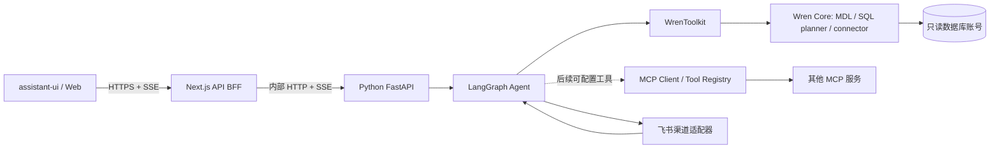

# AskDB 核心问数链路开发文档

- 状态：项目拆分、Web SSE 代理、FastAPI/LangGraph runtime、SQL 门禁和 `askdb_tpcc` 的 Wren MDL 已配置；自然语言到真实查询结果的端到端验收及只读账号权限确认待完成
- 更新日期：2026-10-02
- 工作区：`ASKDB-Agent`

## 1. 目标

让用户在 assistant-ui 页面用自然语言提问，由 LangGraph Agent 调用 WrenToolkit，把 SQL 交给 Wren Core 规划并执行，最终将真实查询结果和解释返回给用户。

首个可验收闭环只需要一个 Wren 项目、一个 MySQL profile 和一个可用模型。当前按已确认选择配置 DeepSeek OpenAI 兼容接口与 `deepseek-v4-flash`。MCP 工具配置和飞书渠道属于后续扩展；它们复用 Agent 能力，不进入首个问数闭环的关键路径。

## 2. 已确认架构



Wren AI Core 是语义建模、SQL 规划和执行层，LLM 的选择与 Agent 循环由 AskDB 的 Python 服务负责。官方 `wren-langchain` 提供 `WrenToolkit`，可将已准备好的 Wren 项目作为 LangChain / LangGraph 工具接入；项目必须已有 profile 和构建后的 MDL。每个 toolkit 绑定一个 Wren 项目。[Wren LangChain SDK](https://github.com/Canner/WrenAI/blob/main/docs/core/sdk/langchain.md) · [Wren Core 架构](https://github.com/Canner/WrenAI/blob/main/docs/core/reference/architecture.md)

## 3. 仓库目录与职责

```text
ASKDB-Agent/
├── askdb-web/                 # Next.js / assistant-ui
│   ├── app/                   # 页面与 BFF Route Handler
│   ├── components/            # 聊天组件
│   ├── package.json
│   └── pnpm-lock.yaml
├── askdb-agent/               # Python Agent API
│   ├── src/askdb_agent/       # FastAPI、LangGraph、Wren runtime
│   ├── tests/                 # Agent/API 行为测试
│   ├── README.md
│   ├── .env.example
│   ├── pyproject.toml
│   └── uv.lock                # Python 依赖锁文件
├── docs/开发文档.md
└── README.md
```

职责边界：

- `askdb-web` 负责聊天输入、消息渲染、SQL/结果展示和连接同源 BFF。浏览器不保存模型密钥或数据库凭证。
- Next.js BFF 负责同源代理、输入大小限制和前端 SSE 适配；不创建数据库连接。
- `askdb-agent` 负责用户/会话上下文、LangGraph 执行图、部署级模型配置、工具授权、SQL 安全策略与流式事件。
- Wren 项目配置、MDL、profile 和数据库凭证由 Wren Core 的项目配置管理；凭证不得提交到仓库。

## 4. 一轮问数的数据流

1. Web 将当前会话消息发给 `/api/chat`，BFF 转发至 Agent API。
2. Agent 校验请求并使用请求中携带的会话消息；`thread_id` 作为 LangGraph 运行配置传递。持久化会话存储尚未启用。
3. LangGraph Agent 使用 Wren 项目的工具与系统指令获取 MDL/业务上下文；配置了 Wren memory 的项目可调用只读记忆工具。
4. LLM 基于 MDL 模型生成候选 SQL，工具门禁拒绝非 SELECT 和未通过 Wren 检查的语句。
5. Agent 先生成候选 SQL，再由后端确定性控制流调用 `toolkit.dry_plan()` 和 `toolkit.dry_run()`，并执行只读 SQL 策略检查。
6. 校验成功后，后端才调用 `toolkit.query()` 执行 SQL；不得把自由工具循环中模型是否遵循“先校验再查询”当作安全边界。
7. Agent 将回答、SQL、列定义、行数据和执行摘要作为 SSE 事件发给 BFF。
8. BFF 将事件转成 assistant-ui runtime 消费的流；错误使用结构化事件返回，不把凭证或内部堆栈发给浏览器。

Wren 当前 LangChain SDK 提供 `WrenToolkit.from_project()`、`get_tools()`、`dry_plan()`、`dry_run()` 和 `query()`。工具包中的 `wren_query` 会执行查询；`dry_plan` 工具只做规划。已实现的 Agent 将标准 `wren_query` 替换为受控工具：只接受一条 MySQL SELECT，拒绝锁定读取及 `SLEEP`、`GET_LOCK`、`LOAD_FILE` 等高风险函数，固定先执行 dry-plan 和 dry-run，成功后才运行查询；数据库只读账号仍是最终权限边界。记忆写入工具关闭，提示词与工具列表保持一致。[Wren LangChain SDK](https://github.com/Canner/WrenAI/blob/main/docs/core/sdk/langchain.md)

## 5. API 契约草案

### Web 请求：`POST /api/chat`

```json
{
  "thread_id": "conversation-id",
  "messages": [
    { "role": "user", "content": "上个月订单总金额是多少？" }
]
}
```

Next.js BFF 将请求转发到 Agent 的 `POST /v1/chat`。请求体最多 64 KiB；Agent 每条消息最多 8 KiB、每轮最多 40 条。

### SSE 事件

| 事件 | 用途 |
|---|---|
| `status` | 进度，例如读取模型上下文、校验 SQL |
| `token` | 增量回答文本 |
| `result` | 经过检查的 SQL、列定义、最多 1000 行结果和截断标记 |
| `error` | 可供用户处理的错误码和说明 |
| `done` | 本轮完成 |

SSE 用于 UI 流式体验；内部工具调用细节默认不完整暴露给用户，避免泄漏敏感上下文。Web 界面展示 SQL 和最多 20 行预览。

## 6. 安全和运行约束

- Wren profile 使用数据库只读账号；应用默认不启用 `wren_store_query`，确认流程后才保存 NL→SQL 知识。
- Agent/API 密钥由服务端环境变量或密钥管理系统提供；Web 端只持有同源会话凭证。
- SQL 只可引用 MDL 中的业务模型；执行前做 dry-plan、dry-run 和只读策略校验。
- 已限制返回行数（最多 1000）、BFF 请求体（64 KiB）和聊天输入长度；SQL 执行超时、并发限制和用户身份授权仍待部署前补齐。Wren LangChain 的查询工具自身也有 1000 行上限。[Wren LangChain SDK](https://github.com/Canner/WrenAI/blob/main/docs/core/sdk/langchain.md)
- 错误区分模型配置、MDL 规划、数据库权限、超时和结果截断；日志不记录密码、API Key 或完整敏感查询结果。
- 一个 Agent runtime 绑定一个 Wren 项目。后续多项目场景需显式授权并选择 toolkit，禁止依赖全局 active profile 的隐式回退。

## 7. MCP 与飞书扩展边界

后续 MCP 配置应建成服务端 `ToolRegistry`，字段至少包括连接 ID、transport、服务端地址或受控启动方式、允许的工具名、凭证引用、超时、启用状态和作用域。任意 stdio 命令会形成代码执行风险；远程 MCP endpoint 也需要域名/IP allowlist、认证和超时控制。Wren MCP 当前 HTTP transport 没有 bearer-token 认证，官方标注为 local-only，因此不能直接作为公网服务暴露。[Wren CLI / MCP 安全说明](https://github.com/Canner/WrenAI/blob/main/docs/core/reference/cli.md)

飞书若作为聊天入口，使用独立 `ChannelAdapter` 接收消息事件并调用同一 Agent API，再通过飞书消息 API 回复；这和 MCP 工具连接是两类适配器。若飞书侧要把 AskDB 作为 MCP 工具调用，则另建 AskDB MCP Server，并单独验证飞书客户端能力。飞书开放平台的机器人方案分别包含接收消息事件和发送消息 API。[飞书开放平台机器人方案](https://open.feishu.cn/solutions/detail/groups?lang=zh-CN)

## 8. 开发里程碑

### M0：项目拆分

- [x] 把 UI 迁至 `askdb-web/`，并接入同源 SSE 路由。
- [x] 建立 `askdb-agent/` Python 项目、锁文件、环境模板和文档。
- [x] 更新根 README、忽略规则和本开发文档。

### M1：Wren Core 基线

- [x] 锁定 Python 3.11+、`wrenai[mysql]`、`wren-langchain` 与 LangGraph 依赖。
- 准备一个 Wren 项目、profile、MDL，执行 `wren context validate`、`wren context build`、`wren profile debug`。
- 用只读数据库账号验证一条 MDL 模型查询。

### M2：问数 Agent

- [x] Python FastAPI 提供 health 和 chat SSE API。
- [x] LangGraph 通过 `WrenToolkit.from_project()` 绑定唯一 Wren 项目和模型配置。
- [x] 查询工具先做 SQL SELECT 校验、Wren plan 和 dry-run；默认关闭知识写入。
- [x] 添加请求校验、查询门禁、失败时不执行查询和 SSE 测试。

### M3：Web 接入与端到端验收

- [x] assistant-ui 从本地 mock adapter 切换到 `/api/chat`。
- [x] 页面消费答案流和查询结果事件，展示 SQL、行列结果与错误反馈。
- 跑通“简单聚合问题 + 同会话追问”，并对照数据库结果确认值、SQL 与 MDL 语义。

### M4：后续扩展

- [x] 部署级共享模型设置、加密 SQLite 持久化、连通性探测与 runtime 热切换。
- MCP ToolRegistry 和权限配置。
- 飞书 `ChannelAdapter`，复用同一 Agent Service。
- 多 Wren 项目和数据治理/连接管理 UI。

## 9. 核心验收条件

1. `askdb-web` 发送自然语言问题并收到 Agent SSE 流。
2. Agent 能检索已构建 MDL 的业务模型，并产出指向 MDL 名称的 SQL。
3. 后端执行规划和 dry-run；失败时不执行查询。
4. 成功时查询只读数据库并将真实行数据呈现在 UI；与数据库独立执行结果一致。
5. 同一 `threadId` 的追问能引用前序语义且不错误复用其他会话内容。
6. 非查询 SQL、超时、连接失败、无关问题和超行数结果均有可理解的结果状态。
7. 密钥不出现在浏览器 bundle、响应体、提交文件或明文日志。

## 10. 模型配置目录与会话选择

模型配置目录为整个 AskDB 部署共享，由侧栏齿轮菜单中的“设置模型”入口打开。用户可新增、编辑、设默认和删除多份配置；每个会话可在输入框旁的模型选择栏单独选择。新会话采用当前默认模型，选择 ID 与会话 metadata 一起保存在浏览器本地 `askdb:chat:threads` 中，不跨浏览器同步。Web 新接口为 `/api/settings/models`，Agent 对应 `/v1/settings/models`；旧的单数 `/settings/model` 路径保留为默认 profile 兼容接口。

Agent 将每个 profile 的 ID、名称、provider、model、base URL 和 Fernet 加密后的 API Key 保存到 `ASKDB_SETTINGS_DB_PATH` 指定的 SQLite 配置目录，默认 profile ID 单独保存。密钥来自 `ASKDB_SETTINGS_ENCRYPTION_KEY`，需要使用 `cryptography.fernet.Fernet.generate_key()` 生成，并放入部署密钥管理系统。读取接口只返回非敏感配置字段和 `api_key_configured`；设置接口统一 `Cache-Control: no-store`。输入密钥只随请求体传给同源 Web BFF 和 Agent；日志、错误和响应不回显密钥。

首次初始化从 `ASKDB_MODEL`、`OPENAI_BASE_URL`、`OPENAI_API_KEY` 读取默认 profile；旧单行 `model_settings` 记录会复制密文迁移为默认 profile。新增或更新配置前会先以最多 16 个输出 token 和 15 秒超时探测模型端点。Agent 按 profile ID 缓存运行时；聊天请求在 SSE 开始前捕获对应 runtime，因此配置更新或删除不改变已开始的请求。聊天 body 只接受配置 ID，不接受模型名、服务地址或 API Key。清除 API Key 后保留 profile 元数据，该配置不再出现在会话选择栏中。

这一功能没有登录和用户级权限隔离，所有能访问 AskDB 的使用者都能修改全局设置。部署只允许可信内网访问 Web，并为浏览器到 Web 反向代理配置 HTTPS。SQLite 文件需放到持久化卷并保护权限；备份须同时保护数据库和 Fernet 密钥。更换 Fernet 密钥须维护窗口内解密旧值并重新加密；密钥丢失时重新录入 API Key。

## 11. 当前环境事实与阻塞项

Python 3.13 和 uv 可用；Agent 虚拟环境已升级到 Wren CLI 0.15.0，以支持当前 Wren 项目格式。`wren-project/` 已绑定 `prod-ro` MySQL profile，并升级到 `schema_version: 4`；从 `askdb_tpcc` 的 `information_schema` 生成了 10 个模型及 10 组外键关系。`wren context validate`、`wren context build` 均通过；10 个模型和 10 组关系的 `wren dry-run` 全部通过，没有读取业务行。Profile 当前虽名为 `prod-ro`，配置用户为 `root`，数据库只读权限尚未得到确认，正式使用前应改成 MySQL 层面受限的只读账号。LangGraph Agent 可在本机成功构建 runtime；真实 DeepSeek API 调用和 UI→Agent→模型→Wren→MySQL 的完整问数结果尚未验收。`wren memory index` 当前使用 grep backend，因此没有生成语义向量索引。`wren-langchain` 0.2.x 使用 Wren CLI 0.15.0 的兼容性依据官方 SDK 文档。[Wren LangChain SDK](https://github.com/Canner/WrenAI/blob/main/docs/core/sdk/langchain.md)

## 多模型设置：加密主密钥缺失时的恢复

Agent 启动时从 `ASKDB_SETTINGS_ENCRYPTION_KEY` 读取 Fernet 主密钥，因此修改该值后必须重启 Agent。若 SQLite 目录尚无已保存配置且主密钥缺失，模型设置接口会返回 `MODEL_SETTINGS_UNAVAILABLE`；仅通过环境变量启动的既有聊天模型仍可继续使用，设置写入和读取须等主密钥配置完成后再操作。

若 SQLite 已保存加密模型配置，而主密钥缺失、格式无效或与保存配置时不匹配，Agent 会失败关闭，模型设置接口返回 `MODEL_SETTINGS_UNAVAILABLE`，聊天不会回退到 `.env` 中的其他模型。应从部署密钥管理系统恢复原主密钥；若原密钥遗失，现有密文无法解密，需要配置新的 Fernet 主密钥并通过模型设置界面重新录入各供应商 API Key、测试连接并确认默认模型。不要删除或覆盖原 SQLite 文件来绕过此错误。
